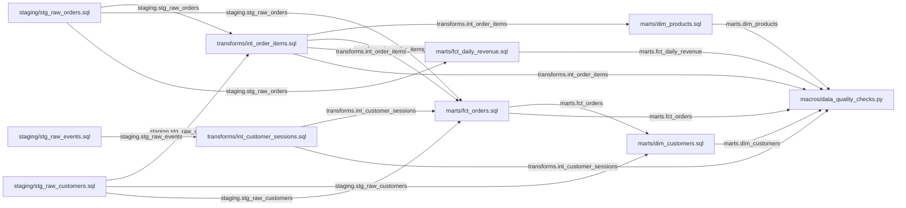

# Data Lineage

```mermaid
graph LR
    stg_raw_customers["staging/stg_raw_customers.sql"]
    stg_raw_orders["staging/stg_raw_orders.sql"]
    stg_raw_events["staging/stg_raw_events.sql"]
    
    int_order_items["transforms/int_order_items.sql"]
    int_customer_sessions["transforms/int_customer_sessions.sql"]
    
    dim_customers["marts/dim_customers.sql"]
    dim_products["marts/dim_products.sql"]
    fct_orders["marts/fct_orders.sql"]
    fct_daily_revenue["marts/fct_daily_revenue.sql"]
    
    dq_checks["macros/data_quality_checks.py"]
    
    stg_raw_customers -->|staging.stg_raw_customers| int_order_items
    stg_raw_orders -->|staging.stg_raw_orders| int_order_items
    stg_raw_events -->|staging.stg_raw_events| int_customer_sessions
    
    stg_raw_customers -->|staging.stg_raw_customers| dim_customers
    stg_raw_customers -->|staging.stg_raw_customers| fct_orders
    stg_raw_orders -->|staging.stg_raw_orders| fct_orders
    stg_raw_orders -->|staging.stg_raw_orders| fct_daily_revenue
    
    int_order_items -->|transforms.int_order_items| dim_products
    int_order_items -->|transforms.int_order_items| fct_orders
    int_order_items -->|transforms.int_order_items| fct_daily_revenue
    int_customer_sessions -->|transforms.int_customer_sessions| fct_orders
    
    fct_orders -->|marts.fct_orders| dim_customers
    
    int_order_items -->|transforms.int_order_items| dq_checks
    int_customer_sessions -->|transforms.int_customer_sessions| dq_checks
    dim_products -->|marts.dim_products| dq_checks
    fct_daily_revenue -->|marts.fct_daily_revenue| dq_checks
    fct_orders -->|marts.fct_orders| dq_checks
    dim_customers -->|marts.dim_customers| dq_checks
```