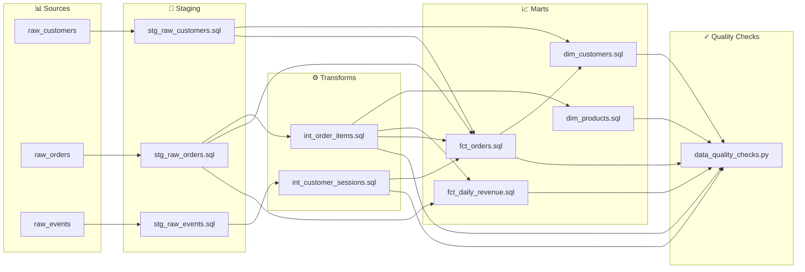

# Data Lineage

## Dependency Edges

| Source File | Target File | Via Table |
|---|---|---|
| `transforms/int_order_items.sql` | `macros/data_quality_checks.py` | `transforms.int_order_items` |
| `marts/dim_products.sql` | `macros/data_quality_checks.py` | `marts.dim_products` |
| `marts/fct_daily_revenue.sql` | `macros/data_quality_checks.py` | `marts.fct_daily_revenue` |
| `transforms/int_customer_sessions.sql` | `macros/data_quality_checks.py` | `transforms.int_customer_sessions` |
| `marts/dim_customers.sql` | `macros/data_quality_checks.py` | `marts.dim_customers` |
| `marts/fct_orders.sql` | `macros/data_quality_checks.py` | `marts.fct_orders` |
| `staging/stg_raw_customers.sql` | `marts/dim_customers.sql` | `staging.stg_raw_customers` |
| `marts/fct_orders.sql` | `marts/dim_customers.sql` | `marts.fct_orders` |
| `transforms/int_order_items.sql` | `marts/dim_products.sql` | `transforms.int_order_items` |
| `staging/stg_raw_orders.sql` | `marts/fct_daily_revenue.sql` | `staging.stg_raw_orders` |
| `transforms/int_order_items.sql` | `marts/fct_daily_revenue.sql` | `transforms.int_order_items` |
| `staging/stg_raw_customers.sql` | `marts/fct_orders.sql` | `staging.stg_raw_customers` |
| `transforms/int_customer_sessions.sql` | `marts/fct_orders.sql` | `transforms.int_customer_sessions` |
| `staging/stg_raw_orders.sql` | `marts/fct_orders.sql` | `staging.stg_raw_orders` |
| `transforms/int_order_items.sql` | `marts/fct_orders.sql` | `transforms.int_order_items` |
| `staging/stg_raw_events.sql` | `transforms/int_customer_sessions.sql` | `staging.stg_raw_events` |
| `staging/stg_raw_orders.sql` | `transforms/int_order_items.sql` | `staging.stg_raw_orders` |
