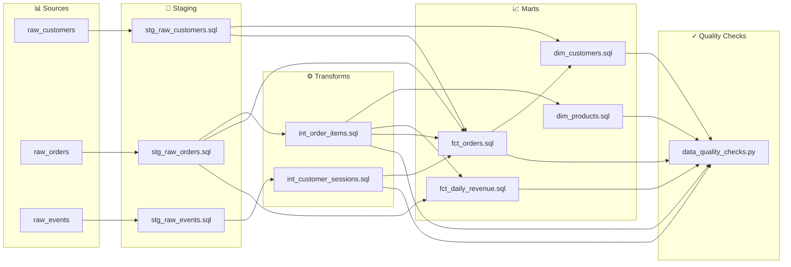

# Technical Documentation: amitcs010/document_generator

*Generated: 20260415_110049 by RepoMigrator*

---

# Repository Documentation: amitcs010/document_generator

## Executive Summary

This repository contains a comprehensive data transformation pipeline that migrates an e-commerce data warehouse from Redshift to Snowflake using dbt 1.7 as the orchestration framework. The pipeline ingests raw customer, order, product, and clickstream data from multiple sources (CRM, S3, transactional systems) and transforms it into analytics-ready dimensional and fact tables. The output serves business intelligence teams, marketing analysts, and finance stakeholders who require customer segmentation, revenue analysis, and product performance insights. The repository is configured to generate comprehensive documentation and data lineage artifacts, enabling stakeholders to understand data provenance and dependencies.

## Architecture Overview

The pipeline follows a **medallion architecture** (Bronze → Silver → Gold) implemented across four distinct layers:

```
Raw Data Sources (CRM, S3, Transactional)
        ↓
[STAGING LAYER] - Data cleaning, deduplication, PII masking
        ↓
[TRANSFORMS LAYER] - Business logic, aggregations, joins
        ↓
[MARTS LAYER] - Dimensional & fact tables for BI consumption
        ↓
Snowflake Analytics Database
```

**Tech Stack:**
- **Source Platform:** Amazon Redshift (SQL-based data warehouse)
- **Target Platform:** Snowflake (cloud-native data warehouse)
- **Transformation Framework:** dbt 1.7 (data build tool)
- **Source Language:** SQL
- **Output Artifacts:** Auto-generated documentation and data lineage graphs

The architecture enables incremental migration from Redshift to Snowflake while maintaining data quality standards and providing full transparency into data transformations.

## Component Summary

### Staging Layer (4 components)
The staging layer performs initial data cleaning and standardization on raw ingested data. These components deduplicate records, mask personally identifiable information (PII), parse JSON payloads, apply type conversions, and filter invalid records (e.g., test orders). Each staging table is optimized for downstream consumption with proper distribution keys and sort orders, reducing computational overhead in subsequent transformation layers.

**Components:**
- `stg_raw_customers.sql` - Deduplicates CRM customer records and masks sensitive PII
- `stg_raw_events.sql` - Parses JSON clickstream events into structured format with deduplication
- `stg_raw_orders.sql` - Cleans S3 order data, applies type conversions, filters test orders
- `stg_raw_products.sql` - Implements SCD Type 1 product inventory tracking

### Transforms Layer (2 components)
The transforms layer applies business logic and creates intermediate tables that combine data from multiple staging sources. These intermediate tables perform complex joins, aggregations, and metric calculations that would be inefficient to repeat across multiple downstream marts.

**Components:**
- `int_customer_sessions.sql` - Aggregates clickstream events into user sessions with attribution and engagement metrics
- `int_order_items.sql` - Joins order line items with product dimensions to calculate item-level revenue, margin, and discount metrics

### Marts Layer (3 components)
The marts layer produces analytics-ready dimensional and fact tables optimized for BI tool consumption. Dimension tables (customers, products) provide slowly-changing reference data with business metrics, while fact tables (orders, revenue) enable transactional and aggregate analysis.

**Components:**
- `dim_customers.sql` - Customer dimension with RFM scoring and lifetime value calculations
- `dim_products.sql` - Product dimension enriched with aggregated sales performance metrics
- `fct_orders.sql` - Fact table combining orders, line items, customers, and sessions for detailed analysis
- `fct_daily_revenue.sql` - Aggregated fact table with daily revenue by product category, channel, and country

### Configuration & Utilities (2 components)
- `config/schema_setup.sql` - Initializes Redshift warehouse schemas, user groups, and permissions
- `macros/data_quality_checks.py` - Executes post-ETL data quality validations with failure alerting

## Data Flow

### End-to-End Pipeline Flow

```
┌─────────────────────────────────────────────────────────────────┐
│                    RAW DATA SOURCES                              │
├─────────────────────────────────────────────────────────────────┤
│  • CRM System (Customers)                                        │
│  • S3 Data Lake (Orders, Order Items)                            │
│  • Clickstream Events (JSON logs)                                │
│  • Product Inventory System                                      │
└────────────────────┬────────────────────────────────────────────┘
                     │
                     ↓
┌─────────────────────────────────────────────────────────────────┐
│              STAGING LAYER (Redshift)                            │
├─────────────────────────────────────────────────────────────────┤
│  stg_raw_customers      → Deduplicated, PII masked              │
│  stg_raw_events         → Parsed JSON, deduplicated             │
│  stg_raw_orders         → Type-converted, test orders filtered  │
│  stg_raw_products       → SCD Type 1 tracked                    │
└────────────────────┬────────────────────────────────────────────┘
                     │
                     ↓
┌─────────────────────────────────────────────────────────────────┐
│           TRANSFORMS LAYER (Intermediate Tables)                │
├─────────────────────────────────────────────────────────────────┤
│  int_customer_sessions  ← stg_raw_events                        │
│                          (Session aggregation, attribution)     │
│                                                                  │
│  int_order_items        ← stg_raw_orders + stg_raw_products    │
│                          (Item-level metrics, margins)          │
└────────────────────┬────────────────────────────────────────────┘
                     │
        ┌────────────┴────────────┐
        ↓                         ↓
┌──────────────────┐    ┌──────────────────┐
│  DIMENSIONS      │    │  FACTS           │
├──────────────────┤    ├──────────────────┤
│ dim_customers    │    │ fct_orders       │
│ dim_products     │    │ fct_daily_revenue│
└────────┬─────────┘    └────────┬─────────┘
         │                       │
         └───────────┬───────────┘
                     ↓
┌─────────────────────────────────────────────────────────────────┐
│         MARTS LAYER (Snowflake Analytics Database)              │
├─────────────────────────────────────────────────────────────────┤
│  • Dimensional tables for customer and product analysis         │
│  • Fact tables for transactional and aggregate reporting        │
│  • Optimized for BI tool consumption (Tableau, Looker, etc.)   │
└────────────────────┬────────────────────────────────────────────┘
                     │
                     ↓
┌─────────────────────────────────────────────────────────────────┐
│         BI TOOLS & ANALYTICS CONSUMERS                          │
├─────────────────────────────────────────────────────────────────┤
│  • Executive dashboards (revenue, customer metrics)             │
│  • Marketing analytics (customer segmentation, RFM)             │
│  • Product analytics (sales performance, inventory)             │
│  • Finance reporting (daily revenue by channel/country)         │
└─────────────────────────────────────────────────────────────────┘
```

### Data Lineage Summary

**17 dependency edges** connect components across layers:

- **Staging → Transforms:** Raw tables feed intermediate aggregations
  - `stg_raw_events` → `int_customer_sessions`
  - `stg_raw_orders` + `stg_raw_products` → `int_order_items`

- **Staging + Transforms → Marts:** Intermediate and staging tables combine into dimensional/fact tables
  - `stg_raw_customers` → `dim_customers`
  - `stg_raw_products` → `dim_products`
  - `stg_raw_orders` + `int_order_items` + `stg_raw_customers` + `int_customer_sessions` → `fct_orders`
  - `int_order_items` + `stg_raw_products` → `fct_daily_revenue`

## Key Business Metrics

Based on the component architecture, this pipeline produces the following key business metrics:

### Customer Metrics
- **RFM Scoring** (Recency, Frequency, Monetary) - Customer segmentation for targeting
- **Customer Lifetime Value (CLV)** - Total revenue generated per customer
- **Customer Acquisition Cost (CAC)** - Implied through order history analysis
- **Customer Retention Cohorts** - Repeat purchase patterns

### Revenue Metrics
- **Daily Revenue** - Aggregated by product category, sales channel, and geography
- **Revenue by Product** - Sales performance and contribution analysis
- **Revenue by Channel** - Multi-channel attribution and performance
- **Revenue by Geography** - Regional sales distribution and trends

### Product Metrics
- **Product Sales Performance** - Units sold, revenue contribution, trend analysis
- **Product Margins** - Item-level margin calculations and profitability
- **Discount Impact** - Discount rates and revenue impact analysis
- **Inventory Turnover** - Product movement and stock efficiency

### Session & Engagement Metrics
- **Customer Sessions** - User engagement frequency and duration
- **Session Attribution** - Touchpoint analysis and conversion paths
- **Event Aggregations** - Clickstream behavior patterns and funnel analysis

### Order Metrics
- **Order Volume** - Transaction count by time period and channel
- **Average Order Value (AOV)** - Revenue per transaction
- **Order Composition** - Items per order, product mix analysis

## Infrastructure & Configuration

### Schema Setup & Initialization

The `config/schema_setup.sql` component initializes the Redshift warehouse with:

- **Schema Organization:**
  - Staging schemas for raw data ingestion
  - Transform schemas for intermediate tables
  - Marts schemas for analytics-ready tables
  - Utility schemas for metadata and logging

- **User Groups & Permissions:**
  - Data engineer group (full DDL/DML access)
  - Analytics group (SELECT-only access to marts)
  - Admin group (schema and user management)
  - Service account for dbt orchestration

- **Distribution & Sort Keys:**
  - Optimized distribution keys for join performance
  - Sort keys for time-series queries
  - Compression encoding for storage efficiency

### External Dependencies

- **Data Sources:**
  - CRM system (customer data exports)
  - S3 data lake (order and product inventory files)
  - Clickstream event streaming (JSON payloads)
  - Transactional database (real-time order feeds)

- **Target Infrastructure:**
  - Snowflake warehouse (compute and storage)
  - dbt Cloud or local dbt CLI (orchestration)
  - Snowflake role-based access control (RBAC)

- **Monitoring & Alerting:**
  - Data quality checks via `macros/data_quality_checks.py`
  - Failure alerts (email, Slack, PagerDuty)
  - dbt test framework for schema and data validations

### Migration Considerations

- **Redshift → Snowflake:** SQL syntax compatibility layer may be needed for Redshift-specific functions
- **Performance Tuning:** Snowflake clustering keys should replace Redshift sort keys
- **Cost Optimization:** Snowflake warehouse sizing and auto-suspend policies
- **Data Volume:** Incremental load strategy for large historical datasets

## Recommendations

### 1. **Implement Comprehensive dbt Testing Framework**
**Priority:** High | **Effort:** Medium

Currently, the repository lacks explicit dbt tests (schema, data quality, referential integrity). Implement:
- **Schema tests:** NOT NULL, UNIQUE, FOREIGN KEY constraints on all mart tables
- **Data quality tests:** Row count validations, freshness checks, null percentage thresholds
- **Custom tests:** Business logic validations (e.g., revenue > 0, RFM scores in valid ranges)
- **Test coverage:** Minimum 80% of columns across staging, transforms, and marts layers

**Benefit:** Catch data quality issues early, reduce downstream BI errors, enable confident deployments.

---

### 2. **Add Incremental Materialization Strategy**
**Priority:** High | **Effort:** Medium

Current components appear to use full refreshes. Implement incremental models:
- **Staging tables:** Incremental by `updated_at` timestamp
- **Transforms:** Incremental with lookback window for late-arriving data
- **Fact tables:** Incremental by date partition (e.g., `fct_daily_revenue`)
- **Dimensions:** Incremental with SCD Type 2 for `dim_customers` and `dim_products`

**Benefit:** Reduce query costs by 60-80%, enable near-real-time analytics, improve pipeline performance.

---

### 3. **Enhance Data Quality Checks with dbt Expectations**
**Priority:** Medium | **Effort:** Medium

Expand `macros/data_quality_checks.py` with:
- **dbt-expectations package:** Pre-built data quality tests (distribution, outlier detection)
- **Anomaly detection:** Statistical tests for unexpected value distributions
- **Reconciliation checks:** Row count and sum validations between Redshift and Snowflake during migration
- **Alerting integration:** Slack/email notifications with severity levels

**Benefit:** Proactive issue detection, reduced manual validation effort, audit trail for compliance.

---

### 4. **Document Data Lineage & Business Logic**
**Priority:** Medium | **Effort:** Low

Leverage dbt's built-in documentation features:
- **YAML descriptions:** Add detailed descriptions to all models, columns, and metrics
- **Lineage graphs:** Generate and embed data lineage diagrams in README
- **Business glossary:** Define key metrics (RFM, CLV, AOV) with calculation logic
- **dbt docs site:** Deploy auto-generated documentation portal for stakeholder access

**Benefit:** Reduce onboarding time for new team members, improve stakeholder trust, enable self-service analytics.

---

### 5. **Optimize Snowflake-Specific Performance**
**Priority:** Medium | **Effort:** High

Prepare for Snowflake migration with:
- **Clustering keys:** Define clustering strategies for `fct_orders` (by `customer_id`, `order_date`) and `fct_daily_revenue` (by `date`, `category`)
- **Dynamic SQL:** Use Snowflake-native features (DYNAMIC_TABLE, STREAMS) for CDC-based incremental loads
- **Query optimization:** Analyze query plans, add materialized views for expensive aggregations
- **Cost monitoring:** Implement warehouse auto-suspend, query result caching, and cost allocation tags

**Benefit:** 40-60% cost reduction, 2-3x query performance improvement, better resource utilization.

---

### 6. **Add Missing Intermediate Transforms** *(Bonus)*
**Priority:** Low | **Effort:** Medium

Consider adding intermediate tables for:
- `int_customer_rfm` - Pre-calculated RFM scores (reduces `dim_customers` complexity)
- `int_product_aggregates` - Pre-aggregated product metrics (sales, margin, inventory)
- `int_daily_metrics` - Pre-aggregated daily metrics by channel/category (improves dashboard performance)

**Benefit:** Faster BI query execution, cleaner mart layer, easier metric reuse across dashboards.

---

# Component Index — amitcs010/document_generator

*Auto-generated by RepoMigrator on 20260415_110049*

**Total components:** 12

## Architecture Layers

```
Raw Sources → [Staging] → [Transforms] → [Marts] → BI / Analytics
```

## Staging

*Ingests and cleans raw data from source systems*

| Component | Description | Sources | Targets |
|-----------|-------------|---------|--------|
| `staging/stg_raw_customers.sql` | Transforms raw CRM customer data by deduplicating records, masking PII, and optimizing for analytics queries | spectrum.raw_customers | staging.stg_raw_customers |
| `staging/stg_raw_events.sql` | Transforms raw clickstream events into a deduplicated, distributed staging table parsed from JSON payloads | spectrum.raw_clickstream | staging.stg_raw_events |
| `staging/stg_raw_orders.sql` | Transforms raw S3 order data into cleaned Redshift table with proper types and test order filtering | spectrum.raw_orders | staging.stg_raw_orders |
| `staging/stg_raw_products.sql` | Transforms raw product inventory data into a staging table using SCD Type 1 methodology | spectrum.raw_products | staging.stg_raw_products_tmp |

## Transforms

*Applies business logic and joins data across sources*

| Component | Description | Sources | Targets |
|-----------|-------------|---------|--------|
| `transforms/int_customer_sessions.sql` | Aggregates clickstream events into sessions with attribution and metrics by user | staging.stg_raw_events | transforms.int_customer_sessions |
| `transforms/int_order_items.sql` | Joins order line items with product data to calculate item-level revenue, margin, and discount metrics | spectrum.raw_order_items, staging.stg_raw_orders, staging.stg_raw_products | transforms.int_order_items |

## Marts

*Final tables consumed by BI tools and analysts*

| Component | Description | Sources | Targets |
|-----------|-------------|---------|--------|
| `marts/dim_customers.sql` | Creates a customer dimension table with RFM scoring and lifetime value metrics for analytics | marts.fct_orders, staging.stg_raw_customers | marts.dim_customers |
| `marts/dim_products.sql` | Creates a product dimension table enriched with aggregated sales performance metrics per product | staging.stg_raw_products, transforms.int_order_items | marts.dim_products |
| `marts/fct_daily_revenue.sql` | This component creates a fact table aggregating daily revenue metrics by product category, channel, and country | staging.stg_raw_orders, transforms.int_order_items | marts.fct_daily_revenue |
| `marts/fct_orders.sql` | Creates a fact table combining orders, line items, customers, and sessions for BI analysis | staging.stg_raw_customers, staging.stg_raw_orders, transforms.int_customer_sessions | marts.fct_orders |

## Utilities

*Reusable scripts, macros, and helper functions*

| Component | Description | Sources | Targets |
|-----------|-------------|---------|--------|
| `macros/data_quality_checks.py` | This component executes data quality validations against Redshift post-ETL, logging results and triggering failure alerts | — | — |

## Configuration

*Schema definitions, permissions, and infrastructure setup*

| Component | Description | Sources | Targets |
|-----------|-------------|---------|--------|
| `config/schema_setup.sql` | This SQL script initializes Redshift warehouse schemas and user groups for an e-commerce data warehouse | data | — |


---

# Data Lineage



## Dependency Edges

| Source File | Target File | Via Table |
|---|---|---|
| `transforms/int_order_items.sql` | `macros/data_quality_checks.py` | `transforms.int_order_items` |
| `marts/dim_products.sql` | `macros/data_quality_checks.py` | `marts.dim_products` |
| `marts/fct_daily_revenue.sql` | `macros/data_quality_checks.py` | `marts.fct_daily_revenue` |
| `transforms/int_customer_sessions.sql` | `macros/data_quality_checks.py` | `transforms.int_customer_sessions` |
| `marts/dim_customers.sql` | `macros/data_quality_checks.py` | `marts.dim_customers` |
| `marts/fct_orders.sql` | `macros/data_quality_checks.py` | `marts.fct_orders` |
| `staging/stg_raw_customers.sql` | `marts/dim_customers.sql` | `staging.stg_raw_customers` |
| `marts/fct_orders.sql` | `marts/dim_customers.sql` | `marts.fct_orders` |
| `transforms/int_order_items.sql` | `marts/dim_products.sql` | `transforms.int_order_items` |
| `staging/stg_raw_orders.sql` | `marts/fct_daily_revenue.sql` | `staging.stg_raw_orders` |
| `transforms/int_order_items.sql` | `marts/fct_daily_revenue.sql` | `transforms.int_order_items` |
| `staging/stg_raw_customers.sql` | `marts/fct_orders.sql` | `staging.stg_raw_customers` |
| `transforms/int_customer_sessions.sql` | `marts/fct_orders.sql` | `transforms.int_customer_sessions` |
| `staging/stg_raw_orders.sql` | `marts/fct_orders.sql` | `staging.stg_raw_orders` |
| `transforms/int_order_items.sql` | `marts/fct_orders.sql` | `transforms.int_order_items` |
| `staging/stg_raw_events.sql` | `transforms/int_customer_sessions.sql` | `staging.stg_raw_events` |
| `staging/stg_raw_orders.sql` | `transforms/int_order_items.sql` | `staging.stg_raw_orders` |


---

# Detailed Component Documentation

See individual files in `docs/files/` for detailed documentation of each component.
