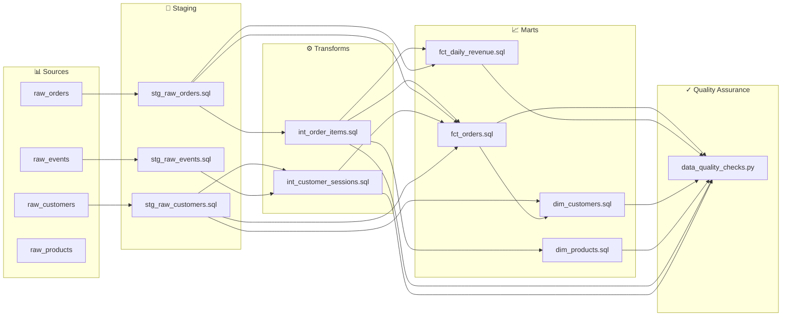

# Technical Documentation: amitcs010/document_generator

*Generated: 20260406_091853 by RepoMigrator*

---

# Repository Documentation: amitcs010/document_generator

## Executive Summary

This repository contains a comprehensive data transformation pipeline that migrates an e-commerce data warehouse from Redshift to Snowflake using dbt 1.7 as the orchestration framework. The pipeline ingests raw customer, order, product, and clickstream data from multiple sources (CRM, S3, and event systems) and transforms it into analytics-ready dimensional and fact tables. The output serves business intelligence teams, executives, and analysts who require real-time insights into customer behavior, revenue trends, and product performance through automated documentation and data lineage tracking.

---

## Architecture Overview

This repository implements a **medallion architecture** (Bronze → Silver → Gold) with four distinct transformation layers:

```
Raw Data Sources (Redshift)
    ↓
[STAGING LAYER] - Data cleaning, deduplication, PII masking
    ↓
[TRANSFORMS LAYER] - Business logic, joins, aggregations, metrics
    ↓
[MARTS LAYER] - Dimensional and fact tables for BI consumption
    ↓
Snowflake Analytics Database
```

**Tech Stack:**
- **Source Platform:** Amazon Redshift (SQL-based data warehouse)
- **Target Platform:** Snowflake (cloud-native data warehouse)
- **Orchestration Framework:** dbt 1.7 (data build tool)
- **Language:** SQL with Python utilities
- **Output:** Auto-generated documentation and data lineage graphs

The migration leverages dbt's abstraction layer to decouple business logic from platform-specific SQL, enabling seamless portability and maintainability across warehouse platforms.

---

## Component Summary

### **Staging Layer** (4 components)
The staging layer performs initial data hygiene and normalization on raw source data. These components deduplicate records, mask personally identifiable information (PII), parse JSON payloads, and filter invalid data (e.g., test orders). Each staging table is optimized for downstream consumption with appropriate distribution keys and sort orders for Redshift performance. This layer acts as a single source of truth for raw data quality, ensuring downstream transformations work with clean, consistent datasets.

### **Transforms Layer** (2 components)
The transforms layer applies business logic and creates intermediate tables that combine data from multiple staging sources. These components perform complex joins (e.g., orders with products and customers), calculate derived metrics (revenue, margin, discounts), and build session-level aggregations from clickstream events. This layer bridges raw data and business-ready analytics, enabling reusability of common calculations across multiple downstream marts.

### **Marts Layer** (4 components)
The marts layer produces final, business-ready dimensional and fact tables optimized for BI tool consumption and executive reporting. Dimension tables (customers, products) include enriched attributes and business metrics (RFM scoring, lifetime value, sales performance), while fact tables (orders, daily revenue) provide granular transaction-level and aggregated reporting views. These tables are designed for fast query performance and intuitive navigation by business users.

### **Configuration & Utilities** (2 components)
The configuration layer initializes Redshift warehouse schemas, user groups, and permissions, establishing the foundational infrastructure for the pipeline. The utilities layer includes automated data quality checks that validate row counts, null distributions, and business rule compliance post-ETL, with integrated alerting for failures.

---

## Data Flow

### **End-to-End Pipeline Flow:**

```
┌─────────────────────────────────────────────────────────────────┐
│                    RAW DATA SOURCES                             │
├─────────────────────────────────────────────────────────────────┤
│  • CRM System → raw_customers                                   │
│  • Order Management → raw_orders (S3)                           │
│  • Product Inventory → raw_products                             │
│  • Clickstream Events → raw_events (JSON)                       │
└────────────────────────┬────────────────────────────────────────┘
                         │
                         ↓
┌─────────────────────────────────────────────────────────────────┐
│              STAGING LAYER (Redshift)                           │
├─────────────────────────────────────────────────────────────────┤
│  stg_raw_customers    → Deduplicate, mask PII                   │
│  stg_raw_orders       → Filter test orders, optimize            │
│  stg_raw_products     → SCD Type 1 methodology                  │
│  stg_raw_events       → Parse JSON, deduplicate events          │
└────────────────────────┬────────────────────────────────────────┘
                         │
                         ↓
┌─────────────────────────────────────────────────────────────────┐
│           TRANSFORMS LAYER (Redshift)                           │
├─────────────────────────────────────────────────────────────────┤
│  int_customer_sessions → Clickstream → Sessions + Attribution   │
│  int_order_items       → Orders + Products → Item Metrics       │
└────────────────────────┬────────────────────────────────────────┘
                         │
                         ↓
┌─────────────────────────────────────────────────────────────────┐
│              MARTS LAYER (Snowflake via dbt)                    │
├─────────────────────────────────────────────────────────────────┤
│  dim_customers        → Customer attributes + RFM + LTV         │
│  dim_products         → Product attributes + Sales metrics      │
│  fct_orders           → Order transactions + dimensions         │
│  fct_daily_revenue    → Daily aggregates by category/channel    │
└────────────────────────┬────────────────────────────────────────┘
                         │
                         ↓
┌─────────────────────────────────────────────────────────────────┐
│         SNOWFLAKE ANALYTICS DATABASE                            │
├─────────────────────────────────────────────────────────────────┤
│  • BI Tools (Tableau, Looker, Power BI)                         │
│  • Executive Dashboards & Reports                               │
│  • Ad-hoc Analytics Queries                                     │
└─────────────────────────────────────────────────────────────────┘
```

### **Data Quality Checkpoints:**
- Post-staging: Automated data quality checks validate row counts, null distributions, and referential integrity
- Pre-marts: Intermediate table validation ensures transform logic correctness
- Post-marts: Final table validation confirms business metric accuracy

### **Dependency Chain (17 edges):**
Raw staging tables → Transform intermediates → Dimension/Fact marts, with quality checks executing at each layer boundary.

---

## Key Business Metrics

Based on the component architecture, this pipeline produces the following key business metrics:

### **Customer Metrics**
- **RFM Scoring:** Recency, Frequency, Monetary segmentation for customer value classification
- **Customer Lifetime Value (CLV):** Aggregate revenue and transaction history per customer
- **Customer Cohorts:** Segmentation by acquisition date, geography, and behavior

### **Revenue Metrics**
- **Daily Revenue:** Aggregated by product category, sales channel, and geographic region
- **Revenue by Product:** Total sales, growth trends, and category performance
- **Channel Performance:** Revenue attribution across direct, affiliate, and marketplace channels

### **Order Metrics**
- **Order Volume:** Transaction counts by time period, customer segment, and product category
- **Average Order Value (AOV):** Mean transaction size with trend analysis
- **Order Margin:** Item-level and order-level profitability metrics
- **Discount Impact:** Discount distribution and revenue impact analysis

### **Product Metrics**
- **Product Performance:** Sales velocity, revenue contribution, and inventory turnover
- **Cross-sell Opportunities:** Product affinity and co-purchase patterns
- **Inventory Health:** Stock levels and SCD Type 1 change tracking

### **Session & Attribution Metrics**
- **Session Metrics:** Session duration, page depth, conversion rates
- **Attribution Models:** First-touch, last-touch, and multi-touch attribution
- **Funnel Analysis:** Clickstream-to-conversion pathways

---

## Infrastructure & Configuration

### **Schema Setup (`config/schema_setup.sql`)**
- Initializes Redshift warehouse schemas with appropriate naming conventions
- Creates user groups and role-based access control (RBAC) for data governance
- Establishes distribution keys and sort keys for query optimization
- Configures table permissions and schema-level privileges

### **Permissions Model**
- **Data Engineers:** Full DDL/DML access to staging and transform layers
- **Analytics Team:** SELECT-only access to marts layer
- **Executives:** Restricted access to aggregated fact tables via BI tools
- **Service Accounts:** dbt orchestration service with schema creation privileges

### **External Dependencies**
- **Redshift Cluster:** Source data warehouse with raw tables
- **S3 Buckets:** Order data ingestion point
- **CRM System:** Customer data source (API or batch export)
- **Event Streaming:** Clickstream event ingestion (JSON payloads)
- **Snowflake Account:** Target warehouse for dbt transformations
- **dbt Cloud/CLI:** Orchestration and scheduling (dbt 1.7)

### **Configuration Parameters**
- **dbt Profiles:** Snowflake connection credentials and warehouse/database settings
- **Variables:** Environment-specific parameters (dev/staging/prod)
- **Seeds:** Reference data for product categories, channels, regions
- **Macros:** Reusable SQL functions for common transformations (deduplication, SCD logic)

---

## Recommendations

### **1. Implement Comprehensive Data Quality Framework**
**Priority:** High | **Effort:** Medium

Currently, data quality checks exist but lack comprehensive coverage. Implement a formal dbt testing framework with:
- **Schema tests:** NOT NULL, UNIQUE, FOREIGN KEY constraints on all marts
- **Custom tests:** Business rule validation (e.g., revenue > 0, RFM scores in valid ranges)
- **Freshness checks:** Alert if source data hasn't updated within SLA windows
- **Row count anomaly detection:** Flag unexpected changes in table volumes

**Action:** Create a `tests/` directory with dbt YAML test definitions and integrate with CI/CD pipeline for automated validation on each dbt run.

---

### **2. Add Comprehensive Documentation & Lineage**
**Priority:** High | **Effort:** Low

Leverage dbt's built-in documentation capabilities (already enabled via `output_docs: "true"`):
- **Column-level documentation:** Add descriptions for all columns in staging, transforms, and marts
- **Business logic documentation:** Document RFM calculation methodology, SCD Type 1 implementation, attribution logic
- **Data dictionary:** Generate auto-updated data dictionary from dbt YAML files
- **Lineage visualization:** Enable `output_lineage: "true"` to generate visual dependency graphs

**Action:** Create comprehensive `schema.yml` files for each layer with column descriptions, business definitions, and owner information. Generate and host dbt docs site for stakeholder access.

---

### **3. Optimize Performance for Snowflake Migration**
**Priority:** Medium | **Effort:** High

The current pipeline is optimized for Redshift (distribution keys, sort keys). Snowflake requires different optimization strategies:
- **Clustering keys:** Define clustering keys on high-cardinality columns (customer_id, product_id, date)
- **Materialization strategy:** Convert staging tables to ephemeral models to reduce storage; use incremental models for large fact tables
- **Query optimization:** Leverage Snowflake's query result caching and dynamic partition pruning
- **Cost optimization:** Implement warehouse auto-suspend and query timeout policies

**Action:** Create Snowflake-specific dbt profiles with clustering key definitions. Benchmark query performance post-migration and adjust materialization strategies based on execution times.

---

### **4. Implement Incremental Loading for Large Fact Tables**
**Priority:** Medium | **Effort:** Medium

Current fact tables (`fct_orders`, `fct_daily_revenue`) likely perform full refreshes, which is inefficient at scale:
- **Incremental models:** Implement dbt incremental materialization for fact tables using `dbt_valid_from` timestamps
- **Upsert logic:** Handle late-arriving facts and corrections with merge logic
- **Partition pruning:** Leverage date-based partitioning for efficient incremental loads

**Action:** Convert `fct_orders` and `fct_daily_revenue` to incremental models with `unique_key` definitions for idempotency. Test incremental logic with historical data before production deployment.

---

### **5. Establish Monitoring, Alerting, & SLA Tracking**
**Priority:** Medium | **Effort:** Medium

Add operational observability to the pipeline:
- **dbt artifacts:** Capture execution logs, timing metrics, and test results
- **Alerting:** Integrate with Slack/PagerDuty for pipeline failures, data quality violations, and SLA breaches
- **Monitoring dashboard:** Track pipeline runtime, row counts, and data freshness
- **SLA definitions:** Document expected refresh frequency and data latency for each mart

**Action:** Implement dbt Cloud job scheduling with failure notifications. Create a monitoring dashboard in Snowflake or Grafana tracking pipeline health metrics. Document SLAs for each data product.

---

### **Bonus: Version Control & CI/CD Best Practices**
- Add `.gitignore` for dbt artifacts and credentials
- Implement branch protection rules requiring dbt test/lint checks before merge
- Create separate dbt environments (dev/staging/prod) with environment-specific profiles
- Document dbt project structure and naming conventions in README

---

# Component Index — amitcs010/document_generator

*Auto-generated by RepoMigrator on 20260406_091853*

**Total components:** 12

## Architecture Layers

```
Raw Sources → [Staging] → [Transforms] → [Marts] → BI / Analytics
```

## Staging

*Ingests and cleans raw data from source systems*

| Component | Description | Sources | Targets |
|-----------|-------------|---------|--------|
| `staging/stg_raw_customers.sql` | Transforms raw CRM customer data by deduplicating records, masking PII, and optimizing for analytics queries | spectrum.raw_customers | staging.stg_raw_customers |
| `staging/stg_raw_events.sql` | Transforms raw clickstream events into a deduplicated, distributed staging table parsed from JSON payloads | spectrum.raw_clickstream | staging.stg_raw_events |
| `staging/stg_raw_orders.sql` | Transforms raw S3 order data into a cleaned, optimized Redshift staging table, filtering test orders | spectrum.raw_orders | staging.stg_raw_orders |
| `staging/stg_raw_products.sql` | Transforms raw product inventory data into a staging table using SCD Type 1 methodology | spectrum.raw_products | staging.stg_raw_products_tmp |

## Transforms

*Applies business logic and joins data across sources*

| Component | Description | Sources | Targets |
|-----------|-------------|---------|--------|
| `transforms/int_customer_sessions.sql` | Transforms clickstream events into sessions with attribution and session-level metrics | staging.stg_raw_events | transforms.int_customer_sessions |
| `transforms/int_order_items.sql` | Joins order line items with product data to calculate item-level revenue, margin, and discount metrics | spectrum.raw_order_items, staging.stg_raw_orders, staging.stg_raw_products | transforms.int_order_items |

## Marts

*Final tables consumed by BI tools and analysts*

| Component | Description | Sources | Targets |
|-----------|-------------|---------|--------|
| `marts/dim_customers.sql` | Creates a customer dimension table with RFM scoring and lifetime value metrics for analytics | marts.fct_orders, staging.stg_raw_customers | marts.dim_customers |
| `marts/dim_products.sql` | Creates a product dimension table enriched with aggregated sales performance metrics by product | staging.stg_raw_products, transforms.int_order_items | marts.dim_products |
| `marts/fct_daily_revenue.sql` | Aggregates daily revenue by product category, channel, and country for executive reporting | staging.stg_raw_orders, transforms.int_order_items | marts.fct_daily_revenue |
| `marts/fct_orders.sql` | Creates a fact table combining orders, line items, customers, and sessions for BI analysis | staging.stg_raw_customers, staging.stg_raw_orders, transforms.int_customer_sessions | marts.fct_orders |

## Utilities

*Reusable scripts, macros, and helper functions*

| Component | Description | Sources | Targets |
|-----------|-------------|---------|--------|
| `macros/data_quality_checks.py` | This component executes automated data quality checks on Redshift post-ETL, logging results and triggering failure alerts | — | — |

## Configuration

*Schema definitions, permissions, and infrastructure setup*

| Component | Description | Sources | Targets |
|-----------|-------------|---------|--------|
| `config/schema_setup.sql` | This SQL script initializes Redshift warehouse schemas and user groups for an e-commerce data warehouse | data | — |


---

# Data Lineage



## Dependency Edges

| Source File | Target File | Via Table |
|---|---|---|
| `marts/fct_orders.sql` | `macros/data_quality_checks.py` | `marts.fct_orders` |
| `marts/fct_daily_revenue.sql` | `macros/data_quality_checks.py` | `marts.fct_daily_revenue` |
| `marts/dim_customers.sql` | `macros/data_quality_checks.py` | `marts.dim_customers` |
| `transforms/int_order_items.sql` | `macros/data_quality_checks.py` | `transforms.int_order_items` |
| `marts/dim_products.sql` | `macros/data_quality_checks.py` | `marts.dim_products` |
| `transforms/int_customer_sessions.sql` | `macros/data_quality_checks.py` | `transforms.int_customer_sessions` |
| `marts/fct_orders.sql` | `marts/dim_customers.sql` | `marts.fct_orders` |
| `staging/stg_raw_customers.sql` | `marts/dim_customers.sql` | `staging.stg_raw_customers` |
| `transforms/int_order_items.sql` | `marts/dim_products.sql` | `transforms.int_order_items` |
| `transforms/int_order_items.sql` | `marts/fct_daily_revenue.sql` | `transforms.int_order_items` |
| `staging/stg_raw_orders.sql` | `marts/fct_daily_revenue.sql` | `staging.stg_raw_orders` |
| `transforms/int_order_items.sql` | `marts/fct_orders.sql` | `transforms.int_order_items` |
| `staging/stg_raw_orders.sql` | `marts/fct_orders.sql` | `staging.stg_raw_orders` |
| `transforms/int_customer_sessions.sql` | `marts/fct_orders.sql` | `transforms.int_customer_sessions` |
| `staging/stg_raw_customers.sql` | `marts/fct_orders.sql` | `staging.stg_raw_customers` |
| `staging/stg_raw_events.sql` | `transforms/int_customer_sessions.sql` | `staging.stg_raw_events` |
| `staging/stg_raw_orders.sql` | `transforms/int_order_items.sql` | `staging.stg_raw_orders` |


---

# Detailed Component Documentation

See individual files in `docs/files/` for detailed documentation of each component.
