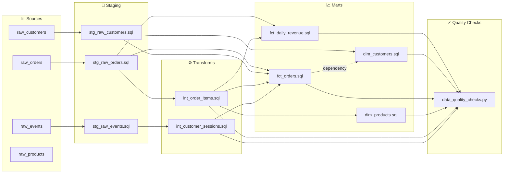

# Technical Documentation: amitcs010/document_generator

*Generated: 20260406_052225 by RepoMigrator*

---

# Repository Documentation: amitcs010/document_generator

## Executive Summary

This repository contains a comprehensive data transformation pipeline that migrates an e-commerce analytics warehouse from Amazon Redshift to Snowflake using dbt 1.7 as the orchestration framework. The pipeline ingests raw customer, product, order, and clickstream data, applies multi-layer transformations (staging → intermediate → marts), and produces analytics-ready fact and dimension tables for BI consumption. The output serves business intelligence teams, marketing analysts, and finance stakeholders who rely on customer segmentation, revenue attribution, and product performance metrics for strategic decision-making.

---

## Architecture Overview

The repository follows a **medallion architecture** pattern with four distinct layers:

```
Raw Data Sources (Redshift)
        ↓
    [STAGING LAYER]
        ↓
    [TRANSFORMS LAYER]
        ↓
    [MARTS LAYER]
        ↓
    Snowflake Analytics Tables
```

**Tech Stack:**
- **Source Platform:** Amazon Redshift (SQL-based data warehouse)
- **Target Platform:** Snowflake (cloud-native data warehouse)
- **Transformation Framework:** dbt 1.7 (data build tool)
- **Language:** SQL with Python utilities
- **Output:** Automated documentation and data lineage graphs

**Data Flow Architecture:**
1. **Staging Layer** (4 components): Ingests raw data from multiple sources (CRM, S3, clickstream), applies basic cleaning, deduplication, and PII masking
2. **Transforms Layer** (2 components): Builds intermediate tables with business logic, sessionization, and cross-domain joins
3. **Marts Layer** (4 components): Creates final analytics tables optimized for BI tools, including dimensional models (customers, products) and fact tables (orders, revenue)
4. **Configuration & Quality** (2 components): Manages schema initialization and post-ETL data quality validation

The architecture enables separation of concerns, incremental development, and clear data lineage tracking across 17 dependency edges.

---

## Component Summary

### **Staging Layer** (4 components)
The staging layer serves as the initial transformation boundary, extracting raw data from heterogeneous sources (CRM systems, S3 data lakes, clickstream platforms) and applying foundational data hygiene. Each staging table performs source-specific transformations: deduplication, JSON parsing, PII masking, test data filtering, and schema normalization. These tables act as a contract layer between raw data ingestion and business logic, ensuring downstream transformations work with clean, consistent data structures.

### **Transforms Layer** (2 components)
The transforms layer builds intermediate business entities by joining staging tables and applying complex business logic. This layer creates session-level metrics from clickstream events (sessionization, attribution modeling) and item-level financial metrics by enriching orders with product dimensions. These intermediate tables reduce redundant calculations in marts and serve as reusable building blocks for multiple downstream analytics use cases.

### **Marts Layer** (4 components)
The marts layer produces final, analytics-ready tables optimized for BI tool consumption and reporting. Dimension tables (`dim_customers`, `dim_products`) provide slowly-changing reference data enriched with aggregated metrics (RFM scores, lifetime value, sales performance). Fact tables (`fct_orders`, `fct_daily_revenue`) denormalize transactional data with pre-aggregated metrics, enabling fast query performance for common analytical queries without requiring joins at query time.

### **Configuration & Quality** (2 components)
The configuration layer initializes Redshift schemas, user groups, and access controls, establishing the foundational infrastructure. The data quality layer executes post-ETL validations (row counts, null checks, referential integrity) and triggers failure alerts, ensuring pipeline reliability and data trustworthiness.

---

## Data Flow

### **End-to-End Pipeline Flow**

```
┌─────────────────────────────────────────────────────────────────┐
│                    RAW DATA SOURCES                              │
├─────────────────────────────────────────────────────────────────┤
│  • CRM System (Customers)                                        │
│  • S3 Data Lake (Orders)                                         │
│  • Clickstream Platform (Events)                                 │
│  • Product Catalog (Products)                                    │
└────────────────┬────────────────────────────────────────────────┘
                 │
                 ↓
┌─────────────────────────────────────────────────────────────────┐
│              STAGING LAYER (Redshift)                            │
├─────────────────────────────────────────────────────────────────┤
│  stg_raw_customers    → Deduplicate, mask PII                   │
│  stg_raw_orders       → Filter test orders, optimize schema     │
│  stg_raw_events       → Parse JSON, deduplicate events          │
│  stg_raw_products     → SCD Type 1 full refresh                 │
└────────────────┬────────────────────────────────────────────────┘
                 │
                 ↓
┌─────────────────────────────────────────────────────────────────┐
│           TRANSFORMS LAYER (Intermediate)                        │
├─────────────────────────────────────────────────────────────────┤
│  int_customer_sessions → Sessionize events, compute metrics     │
│  int_order_items       → Enrich items with product data         │
└────────────────┬────────────────────────────────────────────────┘
                 │
                 ↓
┌─────────────────────────────────────────────────────────────────┐
│              MARTS LAYER (Analytics Tables)                      │
├─────────────────────────────────────────────────────────────────┤
│  dim_customers        → RFM scoring, lifetime value             │
│  dim_products         → Sales performance aggregates            │
│  fct_orders           → Denormalized order transactions         │
│  fct_daily_revenue    → Daily revenue by category/channel       │
└────────────────┬────────────────────────────────────────────────┘
                 │
                 ↓
┌─────────────────────────────────────────────────────────────────┐
│         DATA QUALITY CHECKS & VALIDATION                         │
├─────────────────────────────────────────────────────────────────┤
│  • Row count validation                                          │
│  • Null/uniqueness checks                                        │
│  • Referential integrity tests                                   │
│  • Alert triggers on failures                                    │
└────────────────┬────────────────────────────────────────────────┘
                 │
                 ↓
┌─────────────────────────────────────────────────────────────────┐
│         SNOWFLAKE ANALYTICS WAREHOUSE                            │
├─────────────────────────────────────────────────────────────────┤
│  • BI Tools (Tableau, Looker)                                    │
│  • Ad-hoc Analytics Queries                                      │
│  • Executive Dashboards                                          │
└─────────────────────────────────────────────────────────────────┘
```

**Key Transformations:**
- **Customers:** Raw CRM records → deduplicated, PII-masked staging → enriched with RFM and LTV metrics
- **Orders:** S3 raw files → cleaned staging (test orders filtered) → joined with items and products → fact table with revenue/margin
- **Events:** JSON clickstream → parsed and deduplicated staging → sessionized with attribution → customer session metrics
- **Products:** Raw catalog → SCD Type 1 staging → enriched with sales aggregates → dimension table

---

## Key Business Metrics

Based on the component architecture, this pipeline produces the following analytics-ready metrics:

### **Customer Metrics**
- **RFM Scoring** (Recency, Frequency, Monetary): Customer segmentation for targeting and retention
- **Customer Lifetime Value (CLV)**: Total revenue attributed to each customer across all transactions
- **Customer Cohorts**: Acquisition cohorts for cohort analysis and retention tracking

### **Revenue Metrics**
- **Daily Revenue**: Aggregated by product category, sales channel, and geography
- **Revenue by Product**: Total and incremental revenue per product SKU
- **Revenue by Channel**: Performance comparison across direct, marketplace, and partner channels
- **Revenue by Geography**: Regional revenue distribution and growth trends

### **Order Metrics**
- **Order Volume**: Transaction counts by customer, product, and time period
- **Order Value**: Average order value, order size distribution
- **Item-Level Margin**: Gross margin and discount impact per line item
- **Order Fulfillment**: Order status tracking and fulfillment metrics

### **Product Metrics**
- **Product Performance**: Sales volume, revenue, and margin per product
- **Product Popularity**: Top-selling products, new product adoption
- **Product Profitability**: Margin analysis and discount impact by product

### **Session Metrics**
- **Session Attribution**: Multi-touch attribution modeling for marketing effectiveness
- **Session Engagement**: Session duration, page views, conversion rates
- **Customer Journey**: Funnel analysis and path-to-conversion metrics

---

## Infrastructure & Configuration

### **Schema Setup** (`config/schema_setup.sql`)
- **Purpose:** Initializes Redshift database schemas, tables, and user access controls
- **Scope:** Creates base schemas for staging, transforms, and marts layers
- **User Groups:** Defines role-based access control (RBAC) for analysts, engineers, and stakeholders
- **Permissions Model:**
  - **Data Engineers:** Full DDL/DML on all schemas
  - **Analysts:** SELECT on marts layer only
  - **Stakeholders:** SELECT on marts layer with row-level security (if applicable)

### **External Dependencies**
- **Source Systems:**
  - CRM platform (customer data exports)
  - S3 data lake (order and event data)
  - Clickstream platform (event streaming)
  - Product catalog system
- **Target Infrastructure:**
  - Snowflake warehouse (compute and storage)
  - dbt Cloud or local dbt CLI (orchestration)
  - Alerting system (for data quality failures)

### **Data Quality Framework** (`macros/data_quality_checks.py`)
- **Validation Types:** Row counts, null checks, uniqueness constraints, referential integrity
- **Failure Handling:** Logs validation results and triggers alerts to data engineering team
- **Post-ETL Execution:** Runs after all marts are built to catch data anomalies
- **Integration:** Python macro for flexible, custom validation logic

### **dbt Configuration**
- **Version:** dbt 1.7
- **Profiles:** Configured for Snowflake target platform
- **Documentation:** Auto-generated from YAML configs and SQL comments
- **Lineage:** Automated lineage graphs showing data dependencies across 17 edges

---

## Recommendations

### **1. Implement Comprehensive dbt Testing Framework**
**Priority:** High | **Effort:** Medium

Currently, data quality checks are limited to post-ETL Python macros. Implement dbt's native testing framework with:
- **Generic tests:** not_null, unique, relationships, accepted_values on all key columns
- **Singular tests:** Custom SQL tests for business logic validation (e.g., RFM scores within expected ranges)
- **Freshness checks:** Monitor source data freshness to detect upstream pipeline failures
- **Test coverage target:** Aim for 80%+ coverage on marts and 50%+ on staging/transforms

**Benefit:** Shift-left testing catches data issues earlier, reduces downstream analytics errors, and provides confidence in data quality.

---

### **2. Add Incremental Materialization Strategy**
**Priority:** High | **Effort:** Medium

Current architecture appears to use full refreshes. Implement incremental models for large fact tables:
- **`fct_daily_revenue`:** Incremental by date partition (only process new/updated days)
- **`fct_orders`:** Incremental by order_date with lookback window for late-arriving facts
- **`stg_raw_events`:** Incremental by event_timestamp to reduce processing volume

**Benefit:** Reduces query costs on Snowflake, improves pipeline runtime, enables near-real-time analytics.

---

### **3. Establish Data Lineage Documentation & Governance**
**Priority:** Medium | **Effort:** Low

Leverage dbt's built-in lineage capabilities:
- **Enable dbt docs generation:** `dbt docs generate` to create interactive lineage graphs
- **Add column-level documentation:** Document business definitions, transformations, and data quality rules for each column
- **Create data dictionary:** Publish dbt docs to internal wiki or data catalog (e.g., Collibra, Alation)
- **Implement data ownership:** Tag each model with owner, SLA, and refresh frequency

**Benefit:** Improves data discoverability, reduces onboarding time for new analysts, enables impact analysis for schema changes.

---

### **4. Optimize Dimension Table SCD Strategy**
**Priority:** Medium | **Effort:** Medium

Current `dim_products` uses SCD Type 1 (overwrite). Evaluate SCD Type 2 (track history):
- **Assess use cases:** Do analysts need historical product attributes (e.g., price changes, category changes)?
- **If yes, implement SCD Type 2:** Add `valid_from`, `valid_to`, `is_current` columns to track product evolution
- **If no, optimize Type 1:** Add indexes on frequently-filtered columns (category, status) for query performance

**Benefit:** Enables historical analysis, supports audit requirements, improves query performance with proper indexing.

---

### **5. Add Monitoring & Alerting for Pipeline Health**
**Priority:** Medium | **Effort:** High

Implement comprehensive monitoring beyond data quality checks:
- **dbt Cloud integration:** Monitor job run times, failure rates, and model execution duration
- **Snowflake monitoring:** Track query performance, warehouse utilization, and cost trends
- **Custom alerts:** Set thresholds for:
  - Pipeline runtime exceeding SLA (e.g., >2 hours)
  - Row count anomalies (e.g., >20% variance from baseline)
  - Data freshness violations (e.g., marts not updated within 24 hours)
- **Dashboard:** Create ops dashboard showing pipeline health, recent failures, and performance trends

**Benefit:** Enables proactive issue detection, reduces MTTR (mean time to recovery), improves stakeholder confidence in data reliability.

---

### **6. Document Migration Strategy & Redshift Deprecation Plan**
**Priority:** Medium | **Effort:** Low

Add migration documentation:
- **Cutover plan:** Define date when Snowflake becomes primary analytics platform
- **Validation checklist:** Reconciliation queries comparing Redshift vs. Snowflake outputs
- **Rollback procedure:** Steps to revert to Redshift if issues arise
- **Performance benchmarks:** Document query performance improvements post-migration
- **Cost analysis:** Compare Redshift vs. Snowflake TCO (total cost of ownership)

**Benefit:** Reduces migration risk, provides clear communication to stakeholders, enables data-driven platform decisions.

---

## Summary

The **amitcs010/document_generator** repository represents a well-structured, multi-layer data transformation pipeline designed to migrate e-commerce analytics from Redshift to Snowflake. The medallion architecture (Staging → Transforms → Marts) provides clear separation of concerns and enables scalable, maintainable analytics. With 12 components and 17 dependency edges, the pipeline produces comprehensive business metrics across customers, revenue, orders, products, and sessions.

**Key Strengths:**
- ✅ Clear layered architecture with defined responsibilities
- ✅ Comprehensive data quality framework
- ✅ Rich analytics output (RFM, CLV, revenue attribution)
- ✅ Modern tech stack (dbt 1.7, Snowflake)

**Priority Improvements:**
1. Implement dbt native testing framework (high impact, medium effort)
2. Add incremental materialization for cost/performance (high impact, medium effort)
3. Establish data lineage documentation (medium impact, low effort)
4. Optimize SCD strategy for dimensions (medium impact, medium effort)
5. Add comprehensive monitoring & alerting (medium impact, high effort)

---

# Component Index — amitcs010/document_generator

*Auto-generated by RepoMigrator on 20260406_052225*

**Total components:** 12

## Architecture Layers

```
Raw Sources → [Staging] → [Transforms] → [Marts] → BI / Analytics
```

## Staging

*Ingests and cleans raw data from source systems*

| Component | Description | Sources | Targets |
|-----------|-------------|---------|--------|
| `staging/stg_raw_customers.sql` | Transforms raw CRM customer data by deduplicating records, masking PII, and optimizing for analytics queries | spectrum.raw_customers | staging.stg_raw_customers |
| `staging/stg_raw_events.sql` | Transforms raw clickstream events into a deduplicated, distributed staging table parsed from JSON payloads | spectrum.raw_clickstream | staging.stg_raw_events |
| `staging/stg_raw_orders.sql` | Transforms raw S3 order data into a cleaned, optimized Redshift staging table, filtering test orders | spectrum.raw_orders | staging.stg_raw_orders |
| `staging/stg_raw_products.sql` | This component stages raw product data with full refresh, applying SCD Type 1 logic to overwrite outdated product records | spectrum.raw_products | staging.stg_raw_products_tmp |

## Transforms

*Applies business logic and joins data across sources*

| Component | Description | Sources | Targets |
|-----------|-------------|---------|--------|
| `transforms/int_customer_sessions.sql` | Sessionizes clickstream events into sessions and computes session-level metrics with attribution | staging.stg_raw_events | transforms.int_customer_sessions |
| `transforms/int_order_items.sql` | Joins order line items with product data to calculate item-level revenue, margin, and discount metrics | spectrum.raw_order_items, staging.stg_raw_orders, staging.stg_raw_products | transforms.int_order_items |

## Marts

*Final tables consumed by BI tools and analysts*

| Component | Description | Sources | Targets |
|-----------|-------------|---------|--------|
| `marts/dim_customers.sql` | Creates a customer dimension table with RFM scoring and lifetime value metrics for analytics | marts.fct_orders, staging.stg_raw_customers | marts.dim_customers |
| `marts/dim_products.sql` | Creates a product dimension table enriched with aggregated sales performance metrics per product | staging.stg_raw_products, transforms.int_order_items | marts.dim_products |
| `marts/fct_daily_revenue.sql` | This component creates a fact table aggregating daily revenue by product category, channel, and country | staging.stg_raw_orders, transforms.int_order_items | marts.fct_daily_revenue |
| `marts/fct_orders.sql` | Creates a fact table combining orders, line items, customers, and sessions for BI analysis | staging.stg_raw_customers, staging.stg_raw_orders, transforms.int_customer_sessions | marts.fct_orders |

## Utilities

*Reusable scripts, macros, and helper functions*

| Component | Description | Sources | Targets |
|-----------|-------------|---------|--------|
| `macros/data_quality_checks.py` | This component executes data quality validations against Redshift post-ETL, logging results and triggering failure alerts | — | — |

## Configuration

*Schema definitions, permissions, and infrastructure setup*

| Component | Description | Sources | Targets |
|-----------|-------------|---------|--------|
| `config/schema_setup.sql` | This SQL script initializes Redshift database schemas and user groups for an e-commerce warehouse | data | — |


---

# Data Lineage



## Dependency Edges

| Source File | Target File | Via Table |
|---|---|---|
| `marts/fct_daily_revenue.sql` | `macros/data_quality_checks.py` | `marts.fct_daily_revenue` |
| `marts/dim_customers.sql` | `macros/data_quality_checks.py` | `marts.dim_customers` |
| `marts/fct_orders.sql` | `macros/data_quality_checks.py` | `marts.fct_orders` |
| `marts/dim_products.sql` | `macros/data_quality_checks.py` | `marts.dim_products` |
| `transforms/int_order_items.sql` | `macros/data_quality_checks.py` | `transforms.int_order_items` |
| `transforms/int_customer_sessions.sql` | `macros/data_quality_checks.py` | `transforms.int_customer_sessions` |
| `marts/fct_orders.sql` | `marts/dim_customers.sql` | `marts.fct_orders` |
| `staging/stg_raw_customers.sql` | `marts/dim_customers.sql` | `staging.stg_raw_customers` |
| `transforms/int_order_items.sql` | `marts/dim_products.sql` | `transforms.int_order_items` |
| `staging/stg_raw_orders.sql` | `marts/fct_daily_revenue.sql` | `staging.stg_raw_orders` |
| `transforms/int_order_items.sql` | `marts/fct_daily_revenue.sql` | `transforms.int_order_items` |
| `staging/stg_raw_orders.sql` | `marts/fct_orders.sql` | `staging.stg_raw_orders` |
| `transforms/int_order_items.sql` | `marts/fct_orders.sql` | `transforms.int_order_items` |
| `transforms/int_customer_sessions.sql` | `marts/fct_orders.sql` | `transforms.int_customer_sessions` |
| `staging/stg_raw_customers.sql` | `marts/fct_orders.sql` | `staging.stg_raw_customers` |
| `staging/stg_raw_events.sql` | `transforms/int_customer_sessions.sql` | `staging.stg_raw_events` |
| `staging/stg_raw_orders.sql` | `transforms/int_order_items.sql` | `staging.stg_raw_orders` |


---

# Detailed Component Documentation

See individual files in `docs/files/` for detailed documentation of each component.
