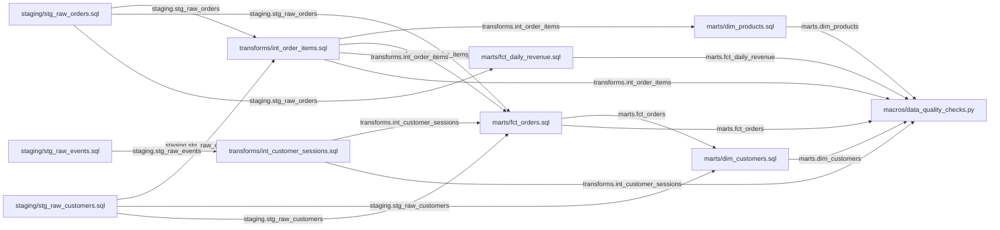

# Technical Documentation: amitcs010/document_generator

# Document Generator - Technical Overview

## Executive Summary
A data migration and transformation pipeline converting Redshift SQL workloads to a modern Snowflake + dbt stack. The project automates ETL processes with 12 interconnected models, implementing dimensional modeling (4 marts) with staging and intermediate transformation layers. Includes automated data quality checks and comprehensive documentation/lineage generation.

## Architecture Overview
```
Redshift (Source)
    ↓
SQL → dbt 1.7 (Transformation Engine)
    ↓
Snowflake (Target Data Warehouse)
    ↓
Documentation + Lineage Output
```

**Components:**
- **Staging Layer** (4 models): Raw data ingestion with minimal transformations
- **Transformation Layer** (2 intermediate models): Business logic and aggregations
- **Mart Layer** (4 models): Dimensional tables (2 dims) and fact tables (2 facts)
- **Macros**: Python-based data quality validation framework
- **Config**: Schema initialization and setup

## Data Flow

```
Raw Sources (Customers, Orders, Products, Events)
    ↓
Staging Models (stg_raw_*)
    ↓
Intermediate Transforms (int_customer_sessions, int_order_items)
    ↓
Dimensional Models (dim_customers, dim_products)
    ↓
Fact Models (fct_orders, fct_daily_revenue)
    ↓
Quality Checks → Documentation & Lineage
```

## Key Tables

| Layer | Model | Purpose |
|-------|-------|---------|
| **Staging** | stg_raw_customers, stg_raw_orders, stg_raw_products, stg_raw_events | Source data normalization |
| **Transform** | int_customer_sessions, int_order_items | Derived metrics & enrichment |
| **Dimension** | dim_customers, dim_products | Slowly changing dimensions |
| **Fact** | fct_orders, fct_daily_revenue | Transactional & aggregate facts |

**Dependencies:** 17 edges indicating moderate complexity with clear upstream/downstream relationships.

---

# Data Lineage


