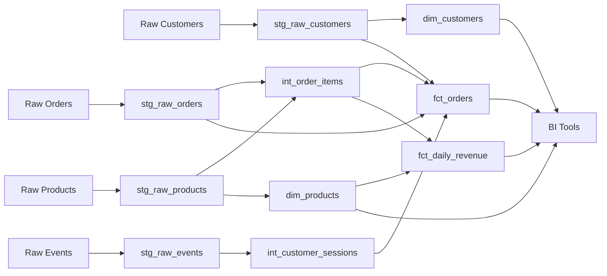

# dbt-snowflake-repo

## Overview

This repository contains a production-grade dbt + Snowflake data pipeline for e-commerce analytics. The pipeline transforms raw customer, product, order, and event data into clean, well-tested dimensional and fact tables optimized for BI and analytics workloads. It was migrated from a legacy Redshift-based system to leverage Snowflake's scalability and dbt's modern data transformation framework.

## Migration Details

| Attribute | Value |
|---|---|
| **Source Repository** | amitcs010/document_generator (Redshift) |
| **Target Platform** | Snowflake + dbt |
| **Target Framework** | dbt Core |
| **Components Migrated** | 12 |
| **Migration Date** | 2026-04-15 |
| **Migration Tool** | RepoMigrator (automated) |

## Repository Structure

```
dbt-snowflake-repo/
├── dbt_project.yml
├── profiles.yml
├── models/
│   ├── staging/
│   │   ├── stg_raw_customers.sql
│   │   ├── stg_raw_events.sql
│   │   ├── stg_raw_orders.sql
│   │   └── stg_raw_products.sql
│   ├── transforms/
│   │   ├── int_customer_sessions.sql
│   │   └── int_order_items.sql
│   └── marts/
│       ├── dim_customers.sql
│       ├── dim_products.sql
│       ├── fct_daily_revenue.sql
│       └── fct_orders.sql
├── macros/
│   └── data_quality_checks.sql
├── config/
│   └── schema_setup.sql
├── tests/
├── docs/
└── README.md
```

## dbt Project Setup

### Prerequisites

- Snowflake account with appropriate warehouse and database permissions
- dbt Core >= 1.7
- Python 3.8+
- Git

### Installation

```bash
# Clone the repository
git clone <repository-url>
cd dbt-snowflake-repo

# Install dbt and dependencies
pip install dbt-snowflake>=1.7.0

# Install dbt package dependencies
dbt deps

# Configure Snowflake connection
# Update profiles.yml with your Snowflake credentials
dbt debug  # Verify connection
```

### Configuration

Update `profiles.yml` with your Snowflake connection details:

```yaml
dbt-snowflake-repo:
  target: dev
  outputs:
    dev:
      type: snowflake
      account: [your-account-id]
      user: [your-username]
      password: [your-password]
      role: [your-role]
      database: analytics_dev
      schema: dbt_dev
      warehouse: compute_wh
      threads: 4
      client_session_keep_alive: false
```

### Running Models

```bash
# Run all models
dbt run

# Run tests
dbt test

# Run specific model layer
dbt run --select staging
dbt run --select transforms
dbt run --select marts

# Run with freshness checks
dbt source freshness

# Generate documentation
dbt docs generate
dbt docs serve
```

## Models

### Staging Layer

| Model | Description | Source | Grain |
|---|---|---|---|
| `stg_raw_customers` | Deduplicated CRM customer data with PII masking | Raw CRM | Customer |
| `stg_raw_events` | Parsed and deduplicated clickstream events from JSON payloads | Raw Events (S3) | Event |
| `stg_raw_orders` | Cleaned order data with type casting and test order filtering | Raw Orders (S3) | Order |
| `stg_raw_products` | Product inventory data with SCD Type 1 tracking | Raw Products | Product |

### Transforms Layer

| Model | Description | Dependencies | Grain |
|---|---|---|---|
| `int_customer_sessions` | Aggregated clickstream sessions with attribution and user metrics | stg_raw_events | Session |
| `int_order_items` | Item-level revenue, margin, and discount calculations | stg_raw_orders, stg_raw_products | Order Item |

### Marts Layer

| Model | Description | Grain | Refresh Frequency |
|---|---|---|---|
| `dim_customers` | Customer dimension with RFM scoring and lifetime value metrics | Customer | Daily |
| `dim_products` | Product dimension enriched with aggregated sales performance | Product | Daily |
| `fct_daily_revenue` | Daily revenue aggregated by product category, channel, and country | Day + Category + Channel + Country | Daily |
| `fct_orders` | Comprehensive order fact table combining orders, items, customers, and sessions | Order | Daily |

## Data Lineage



## Key Changes from Source

### Platform Migration (Redshift → Snowflake)

- **SQL Dialect**: Converted Redshift-specific functions to Snowflake equivalents
  - `DISTKEY` → Snowflake clustering keys
  - `SORTKEY` → Snowflake clustering keys
  - String functions adapted for Snowflake syntax
  
- **DDL Removal**: Explicit `CREATE TABLE` statements replaced with dbt materializations
  - Schema initialization handled via `dbt run`
  - User groups and permissions managed separately
  
- **Table References**: Updated to dbt conventions
  - Raw tables referenced via `source()` macro
  - Model references use `ref()` macro for dependency tracking
  
- **Data Quality**: Python-based validation converted to dbt tests
  - Generic tests for null checks, uniqueness, referential integrity
  - Custom macros for domain-specific validations
  
- **Performance Optimization**: Leveraged Snowflake capabilities
  - Clustering keys for common filter patterns
  - Dynamic partition pruning
  - Optimized for Snowflake's columnar storage

## Testing & Quality

All models include:
- **Uniqueness tests** on primary keys
- **Not null tests** on critical dimensions
- **Referential integrity tests** between fact and dimension tables
- **Custom data quality checks** via `data_quality_checks` macro

Run tests with:
```bash
dbt test
```

## Documentation

Comprehensive documentation is available in the `docs/` directory:

- **[FULL_DOCUMENTATION.md](docs/FULL_DOCUMENTATION.md)** - Complete technical documentation
- **[COMPONENT_INDEX.md](docs/COMPONENT_INDEX.md)** - Index of all migrated components
- **[DATA_LINEAGE.md](docs/DATA_LINEAGE.md)** - Detailed data lineage and dependencies
- **[VALIDATION_REPORT.json](docs/VALIDATION_REPORT.json)** - Migration validation results
- **[Per-Model Documentation](docs/files/)** - Individual model specifications

Generate and serve dbt documentation:
```bash
dbt docs generate
dbt docs serve
```

## Support & Troubleshooting

### Common Issues

**Connection Error**: Verify Snowflake credentials in `profiles.yml` and network connectivity

**Model Failures**: Check Snowflake warehouse is running and user has appropriate permissions

**Test Failures**: Review test results in `target/compiled/` and adjust model logic as needed

### Contributing

1. Create a feature branch
2. Make changes and test locally: `dbt run && dbt test`
3. Generate updated documentation: `dbt docs generate`
4. Submit pull request with description of changes

## Metadata

| Attribute | Value |
|---|---|
| **Auto-Generated** | Yes (RepoMigrator) |
| **Source** | amitcs010/document_generator |
| **Last Updated** | 2026-04-15 10:00:49 UTC |
| **dbt Version** | >= 1.7 |
| **Snowflake Edition** | Standard or higher |

---

*This repository was automatically migrated from Redshift to Snowflake using RepoMigrator. For migration details or questions, refer to the documentation or contact the data engineering team.*