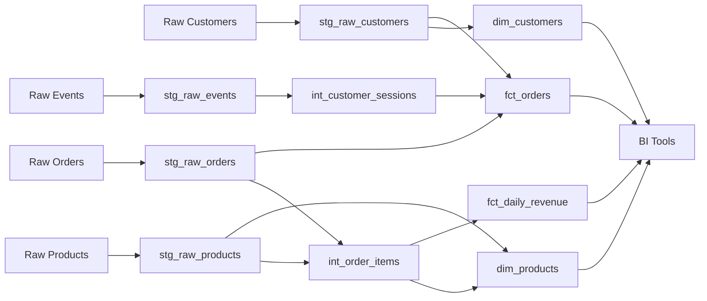

# dbt-snowflake-repo

## Overview

This repository contains a production-grade dbt + Snowflake data pipeline for an e-commerce analytics warehouse. The pipeline transforms raw customer, product, order, and clickstream data into clean, aggregated analytics-ready tables supporting BI and reporting use cases. It includes 12 migrated components spanning staging, transformation, and mart layers with built-in data quality checks and RFM/LTV analytics.

## Migration Details

| Attribute | Value |
|---|---|
| **Source Repository** | amitcs010/document_generator (Redshift) |
| **Target Platform** | Snowflake + dbt |
| **Target Framework** | dbt Core |
| **Components Migrated** | 12 |
| **Migration Tool** | RepoMigrator (automated) |
| **Migration Date** | 2026-04-06 05:22:25 UTC |

## Repository Structure

```
dbt-snowflake-repo/
├── config/
│   └── schema_setup.sql              # Database schema and user group initialization
├── macros/
│   └── data_quality_checks.py        # Data quality validation utilities
├── models/
│   ├── staging/
│   │   ├── stg_raw_customers.sql     # Customer data staging
│   │   ├── stg_raw_events.sql        # Clickstream events staging
│   │   ├── stg_raw_orders.sql        # Order data staging
│   │   └── stg_raw_products.sql      # Product data staging
│   ├── transforms/
│   │   ├── int_customer_sessions.sql # Session-level metrics
│   │   └── int_order_items.sql       # Item-level revenue metrics
│   └── marts/
│       ├── dim_customers.sql         # Customer dimension with RFM/LTV
│       ├── dim_products.sql          # Product dimension with performance metrics
│       ├── fct_daily_revenue.sql     # Daily revenue fact table
│       └── fct_orders.sql            # Orders fact table
├── docs/
│   ├── FULL_DOCUMENTATION.md         # Comprehensive technical documentation
│   ├── COMPONENT_INDEX.md            # Component reference guide
│   ├── DATA_LINEAGE.md               # Data flow documentation
│   ├── VALIDATION_REPORT.json        # Migration validation results
│   └── files/                        # Per-model documentation
├── dbt_project.yml
├── packages.yml
└── README.md
```

## dbt Project Setup

### Prerequisites

- Snowflake account with appropriate permissions (warehouse, database, schema creation)
- dbt Core >= 1.7
- Python 3.8+
- Git

### Installation

```bash
# Clone the repository
git clone <repository-url>
cd dbt-snowflake-repo

# Install dbt and dependencies
pip install dbt-snowflake>=1.7.0
dbt deps

# Configure Snowflake connection
# Edit ~/.dbt/profiles.yml with your Snowflake credentials
```

### Configuration

Create or update `~/.dbt/profiles.yml`:

```yaml
dbt-snowflake-repo:
  target: dev
  outputs:
    dev:
      type: snowflake
      account: [your-account-id]
      user: [your-username]
      password: [your-password]
      role: [your-role]
      database: analytics_dev
      schema: dbt_dev
      warehouse: compute_wh
      threads: 4
      client_session_keep_alive: false
```

### Running dbt

```bash
# Run all models
dbt run

# Run tests
dbt test

# Run specific model layer
dbt run --select staging
dbt run --select transforms
dbt run --select marts

# Run with freshness checks
dbt source freshness

# Generate documentation
dbt docs generate
dbt docs serve
```

## Models

### Staging Layer

| Model | Description | Source | Grain |
|---|---|---|---|
| `stg_raw_customers` | Deduplicated customer data with PII masking | CRM system | Customer |
| `stg_raw_events` | Parsed clickstream events from JSON payloads | S3/Event stream | Event |
| `stg_raw_orders` | Cleaned order data with test order filtering | S3 | Order |
| `stg_raw_products` | Product catalog with SCD Type 1 logic | Product DB | Product |

### Transforms Layer

| Model | Description | Dependencies | Grain |
|---|---|---|---|
| `int_customer_sessions` | Sessionized clickstream with attribution metrics | stg_raw_events | Session |
| `int_order_items` | Item-level revenue, margin, and discount calculations | stg_raw_orders, stg_raw_products | Order Item |

### Marts Layer

| Model | Description | Dependencies | Grain |
|---|---|---|---|
| `dim_customers` | Customer dimension with RFM scoring and LTV | stg_raw_customers, fct_orders | Customer |
| `dim_products` | Product dimension with aggregated sales performance | stg_raw_products, int_order_items | Product |
| `fct_daily_revenue` | Daily revenue aggregated by product, category, channel, country | int_order_items | Day-Product-Channel-Country |
| `fct_orders` | Comprehensive orders fact table with customer and session context | stg_raw_orders, stg_raw_customers, int_customer_sessions | Order |

## Data Lineage



## Key Changes from Source

### Platform Migration (Redshift → Snowflake)

- **SQL Dialect**: Converted Redshift-specific functions to Snowflake equivalents
  - `DISTKEY` → Snowflake clustering keys
  - `SORTKEY` → Snowflake clustering
  - `UNLOAD` → Snowflake `COPY INTO`
  
- **DDL Handling**: Removed explicit `CREATE TABLE` statements; dbt manages materialization via `dbt_project.yml`

- **Table References**: Converted hardcoded table names to dbt `ref()` and `source()` macros for dependency tracking

- **Data Types**: Updated Redshift-specific types to Snowflake equivalents (e.g., `VARCHAR(MAX)` → `VARCHAR`)

- **Performance**: Leveraged Snowflake's clustering and query optimization; removed Redshift-specific tuning

### Framework Migration (SQL → dbt)

- **Modularity**: Decomposed monolithic SQL scripts into reusable dbt models
- **Testing**: Added dbt tests for data quality validation (replaces `data_quality_checks.py`)
- **Documentation**: Integrated dbt YAML documentation for lineage and metadata
- **Version Control**: Models now tracked in Git with change history

## Data Quality

Data quality checks are executed via dbt tests and custom macros:

```bash
dbt test  # Run all tests
```

Tests include:
- Uniqueness and not-null constraints on key columns
- Referential integrity between fact and dimension tables
- Freshness checks on source data
- Custom validation rules (e.g., revenue > 0)

See `macros/data_quality_checks.py` for custom validation logic.

## Documentation

Comprehensive documentation is available in the `docs/` directory:

- **[FULL_DOCUMENTATION.md](docs/FULL_DOCUMENTATION.md)** - Complete technical reference
- **[COMPONENT_INDEX.md](docs/COMPONENT_INDEX.md)** - Detailed component descriptions
- **[DATA_LINEAGE.md](docs/DATA_LINEAGE.md)** - Data flow and dependencies
- **[VALIDATION_REPORT.json](docs/VALIDATION_REPORT.json)** - Migration validation results
- **Per-model docs** - Individual model documentation in `docs/files/`

Generate interactive documentation:

```bash
dbt docs generate
dbt docs serve  # Opens http://localhost:8000
```

## Support & Troubleshooting

### Common Issues

**Connection Error**: Verify Snowflake credentials in `~/.dbt/profiles.yml`

**Model Failures**: Check `target/compiled/` for compiled SQL and `target/run_results.json` for error details

**Performance**: Monitor warehouse utilization; consider scaling warehouse size for large datasets

### Logs

- dbt logs: `logs/dbt.log`
- Run artifacts: `target/run_results.json`

## Contributing

1. Create a feature branch: `git checkout -b feature/new-model`
2. Develop and test locally: `dbt run && dbt test`
3. Document changes in model YAML
4. Submit pull request with validation results

## Auto-Generated Notice

This repository and README were auto-generated by **RepoMigrator** from the source repository `amitcs010/document_generator` (Redshift).

**Last Updated**: 2026-04-06 05:22:25 UTC

For migration details and validation results, see `docs/VALIDATION_REPORT.json`.

---

**Maintainer**: Data Engineering Team  
**License**: [Your License Here]