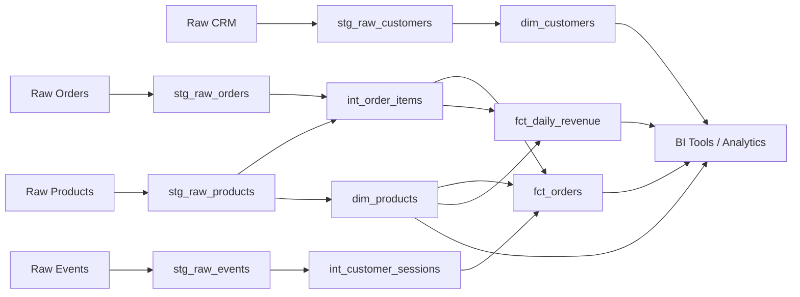

# dbt-snowflake-repo

## Overview

This repository contains a production-grade dbt + Snowflake data pipeline for an e-commerce analytics platform. The pipeline transforms raw data from multiple sources (CRM, clickstream, orders, inventory) into clean, well-documented staging, transformation, and mart layers. It provides dimensional models for customer analytics, product performance, and revenue reporting with built-in data quality checks and RFM/LTV scoring capabilities.

## Migration Details

| Attribute | Value |
|---|---|
| **Source Repository** | amitcs010/document_generator (Redshift) |
| **Target Platform** | Snowflake + dbt |
| **Target Framework** | dbt Core |
| **Components Migrated** | 12 |
| **Migration Tool** | RepoMigrator (automated) |
| **Migration Date** | 2026-04-14 |

## Repository Structure

```
dbt-snowflake-repo/
├── dbt_project.yml
├── profiles.yml
├── models/
│   ├── staging/
│   │   ├── stg_raw_customers.sql
│   │   ├── stg_raw_events.sql
│   │   ├── stg_raw_orders.sql
│   │   └── stg_raw_products.sql
│   ├── transforms/
│   │   ├── int_customer_sessions.sql
│   │   └── int_order_items.sql
│   └── marts/
│       ├── dim_customers.sql
│       ├── dim_products.sql
│       ├── fct_daily_revenue.sql
│       └── fct_orders.sql
├── macros/
│   └── data_quality_checks.sql
├── tests/
├── docs/
│   ├── FULL_DOCUMENTATION.md
│   ├── COMPONENT_INDEX.md
│   ├── DATA_LINEAGE.md
│   ├── VALIDATION_REPORT.json
│   └── files/
└── config/
    └── schema_setup.sql
```

## dbt Project Setup

### Prerequisites

- Snowflake account with appropriate permissions (warehouse, database, schema creation)
- dbt Core >= 1.7
- Python 3.8+
- Git

### Installation

```bash
# Clone the repository
git clone <repository-url>
cd dbt-snowflake-repo

# Install dbt and dependencies
pip install dbt-snowflake>=1.7.0
dbt deps

# Configure Snowflake connection
# Update profiles.yml with your Snowflake credentials
dbt debug  # Verify connection
```

### Configuration

Update `profiles.yml` with your Snowflake credentials:

```yaml
dbt-snowflake-repo:
  target: dev
  outputs:
    dev:
      type: snowflake
      account: [your-account-id]
      user: [your-username]
      password: [your-password]
      role: [your-role]
      database: analytics_dev
      schema: dbt_dev
      warehouse: compute_wh
      threads: 4
      client_session_keep_alive: false
```

### Running Models

```bash
# Run all models
dbt run

# Run tests
dbt test

# Run specific layer
dbt run --select staging
dbt run --select transforms
dbt run --select marts

# Run with data quality checks
dbt run --select tag:quality_checks

# Generate documentation
dbt docs generate
dbt docs serve
```

## Models

### Staging Layer

| Model | Description | Source | Grain |
|---|---|---|---|
| `stg_raw_customers` | Deduplicated CRM customer data with PII masking | CRM system | Customer |
| `stg_raw_events` | Cleaned clickstream events from JSON | Event tracking system | Event |
| `stg_raw_orders` | Filtered and optimized order data (excludes test orders) | S3 / Order system | Order |
| `stg_raw_products` | Product inventory with SCD Type 1 methodology | Inventory system | Product |

### Transforms Layer

| Model | Description | Dependencies | Grain |
|---|---|---|---|
| `int_customer_sessions` | Sessionized clickstream with session-level metrics and attribution | stg_raw_events | Session |
| `int_order_items` | Order line items enriched with product data, revenue, margin, discounts | stg_raw_orders, stg_raw_products | Order Item |

### Marts Layer

| Model | Description | Grain | Key Metrics |
|---|---|---|---|
| `dim_customers` | Customer dimension with RFM scoring and lifetime value | Customer | LTV, RFM Score, Segment |
| `dim_products` | Product dimension with aggregated sales performance | Product | Total Sales, Avg Rating, Units Sold |
| `fct_daily_revenue` | Daily revenue aggregated by product category, channel, country | Day + Category + Channel + Country | Revenue, Units, Margin |
| `fct_orders` | Comprehensive order fact table combining orders, items, customers, sessions | Order | Revenue, Discount, Margin, Attribution |

## Data Lineage



## Key Changes from Source

### Platform Migration (Redshift → Snowflake)

- **SQL Syntax**: Converted Redshift-specific functions to Snowflake equivalents
  - `DISTKEY` → Snowflake clustering keys
  - `SORTKEY` → Snowflake clustering
  - `VACUUM` → Snowflake auto-clustering
  
- **DDL Removal**: Schema creation and table materialization now handled by dbt
  - Removed `CREATE TABLE` statements
  - Removed `GRANT` statements (managed via Snowflake roles)
  - Converted to dbt models with appropriate materialization configs

- **Data Quality**: Python-based checks converted to dbt macros
  - `data_quality_checks.py` → `data_quality_checks.sql` macro
  - Integrated with dbt test framework
  - Automated failure alerts via dbt hooks

- **References**: Updated all table references to use dbt conventions
  - Raw tables → `source()` macro
  - Model references → `ref()` macro
  - Enables automatic lineage tracking

- **Performance Optimization**: Leveraged Snowflake capabilities
  - Clustering keys on high-cardinality columns
  - Dynamic table materialization strategies
  - Query result caching

## Documentation

Comprehensive documentation is available in the `docs/` directory:

- **[FULL_DOCUMENTATION.md](docs/FULL_DOCUMENTATION.md)** - Complete technical documentation
- **[COMPONENT_INDEX.md](docs/COMPONENT_INDEX.md)** - Index of all 12 migrated components
- **[DATA_LINEAGE.md](docs/DATA_LINEAGE.md)** - Detailed data flow and dependencies
- **[VALIDATION_REPORT.json](docs/VALIDATION_REPORT.json)** - Migration validation results
- **[Per-Model Documentation](docs/files/)** - Individual model specifications

## Data Quality & Testing

The pipeline includes automated data quality checks:

- **Uniqueness tests** on primary keys (customer_id, order_id, product_id)
- **Not null tests** on critical dimensions
- **Referential integrity** between facts and dimensions
- **Freshness checks** on source data
- **Custom macros** for business logic validation (RFM scoring, revenue calculations)

Run tests with:
```bash
dbt test
```

## Support & Maintenance

- Review migration validation report: `docs/VALIDATION_REPORT.json`
- Check component index for detailed specifications: `docs/COMPONENT_INDEX.md`
- Monitor data quality test results in dbt Cloud or local runs
- Update `dbt_project.yml` for environment-specific configurations

## Auto-Generated Notice

This repository and README were auto-generated by **RepoMigrator** from the source repository `amitcs010/document_generator` (Redshift-based).

**Last Updated**: 2026-04-14 21:11:55 UTC

---

For questions or issues, please refer to the documentation or contact the data engineering team.