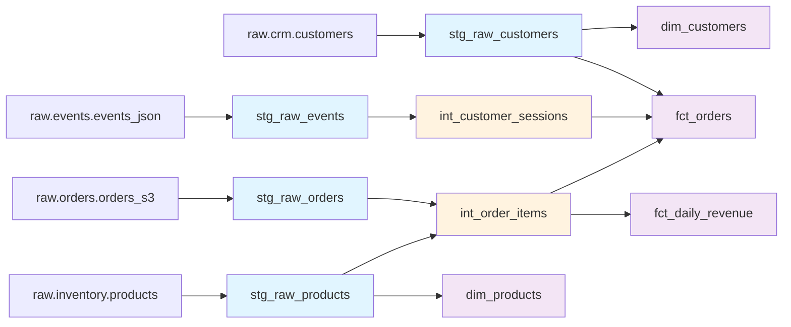

# dbt-snowflake-repo

## Overview

This repository contains a production-grade dbt + Snowflake data pipeline for an e-commerce analytics warehouse. The pipeline transforms raw customer, product, order, and event data into clean, well-documented dimensional and fact tables optimized for BI and analytics use cases. It includes comprehensive data quality checks, RFM scoring, customer lifetime value calculations, and session-level attribution modeling.

## Migration Details

| Attribute | Value |
|---|---|
| **Source Repository** | amitcs010/document_generator (Redshift) |
| **Target Platform** | Snowflake + dbt |
| **Target Framework** | dbt Core |
| **Components Migrated** | 12 |
| **Migration Tool** | RepoMigrator (automated) |
| **Migration Date** | 2026-04-15 12:07:18 UTC |

## Repository Structure

```
dbt-snowflake-repo/
├── models/
│   ├── staging/
│   │   ├── stg_raw_customers.sql
│   │   ├── stg_raw_events.sql
│   │   ├── stg_raw_orders.sql
│   │   └── stg_raw_products.sql
│   ├── transforms/
│   │   ├── int_customer_sessions.sql
│   │   └── int_order_items.sql
│   └── marts/
│       ├── dim_customers.sql
│       ├── dim_products.sql
│       ├── fct_daily_revenue.sql
│       └── fct_orders.sql
├── macros/
│   └── data_quality_checks.sql
├── config/
│   └── schema_setup.sql
├── tests/
├── docs/
│   ├── FULL_DOCUMENTATION.md
│   ├── COMPONENT_INDEX.md
│   ├── DATA_LINEAGE.md
│   ├── VALIDATION_REPORT.json
│   └── files/
├── dbt_project.yml
├── profiles.yml.example
└── README.md
```

## dbt Project Setup

### Prerequisites

- Snowflake account with appropriate permissions (warehouse, database, schema creation)
- dbt Core >= 1.7
- Python 3.8+
- Git

### Installation

```bash
# Clone the repository
git clone <repository-url>
cd dbt-snowflake-repo

# Install dbt and dependencies
pip install dbt-snowflake>=1.7.0

# Install dbt packages
dbt deps

# Configure Snowflake connection
cp profiles.yml.example ~/.dbt/profiles.yml
# Edit ~/.dbt/profiles.yml with your Snowflake credentials
```

### Configuration

Update `~/.dbt/profiles.yml` with your Snowflake connection details:

```yaml
dbt-snowflake-repo:
  target: dev
  outputs:
    dev:
      type: snowflake
      account: [account_id]
      user: [username]
      password: [password]
      role: [role]
      database: [database]
      schema: analytics_dev
      warehouse: [warehouse]
      threads: 4
      client_session_keep_alive: false
```

### Running Models

```bash
# Run all models
dbt run

# Run with tests
dbt run && dbt test

# Run specific model selection
dbt run --select staging
dbt run --select marts
dbt run --select dim_customers

# Run with full refresh
dbt run --full-refresh

# Generate documentation
dbt docs generate
dbt docs serve
```

## Models

### Staging Layer

| Model | Description | Source |
|---|---|---|
| `stg_raw_customers` | Deduplicated CRM customer data with PII masking | `raw.crm.customers` |
| `stg_raw_events` | Deduplicated clickstream events from JSON | `raw.events.events_json` |
| `stg_raw_orders` | Cleaned S3 order data with test order filtering | `raw.orders.orders_s3` |
| `stg_raw_products` | Product inventory data with SCD Type 1 tracking | `raw.inventory.products` |

### Transforms Layer

| Model | Description | Dependencies |
|---|---|---|
| `int_customer_sessions` | Sessionized clickstream events with session-level metrics and attribution | `stg_raw_events` |
| `int_order_items` | Order line items enriched with product data, revenue, margin, and discount calculations | `stg_raw_orders`, `stg_raw_products` |

### Marts Layer

| Model | Description | Grain |
|---|---|---|
| `dim_customers` | Customer dimension with RFM scoring and lifetime value metrics | One row per customer |
| `dim_products` | Product dimension enriched with aggregated sales performance metrics | One row per product |
| `fct_daily_revenue` | Daily revenue aggregations by product category, channel, and country | One row per day/category/channel/country |
| `fct_orders` | Comprehensive order fact table combining orders, line items, customers, and sessions | One row per order line item |

## Data Lineage



## Key Changes from Source

### Platform Migration (Redshift → Snowflake)

- **SQL Syntax**: Redshift-specific functions converted to Snowflake equivalents
  - `DISTKEY` → Snowflake clustering keys
  - `SORTKEY` → Snowflake clustering keys
  - Date functions standardized to Snowflake syntax

- **DDL Removal**: Schema creation and table definitions removed; dbt handles all materialization via `dbt_project.yml`

- **Table References**: All hardcoded table names converted to dbt `ref()` and `source()` macros for dependency tracking

- **Data Quality**: Python-based validation macro converted to SQL-native dbt tests and custom macros

- **Performance**: Optimized for Snowflake's columnar architecture and query optimization

### Framework Migration (Raw SQL → dbt)

- Introduced staging, transforms, and marts layers following dbt best practices
- Added comprehensive documentation and testing framework
- Implemented version control and CI/CD ready structure
- Added data lineage and dependency management

## Data Quality & Testing

Data quality checks are executed via the `data_quality_checks` macro and include:

- Null value validation on critical fields
- Referential integrity checks between dimensions and facts
- Duplicate detection on key columns
- Freshness validation on source data
- Custom business logic validations

Run tests with:

```bash
dbt test
dbt test --select dim_customers
```

## Documentation

Comprehensive documentation is available in the `docs/` directory:

- **`FULL_DOCUMENTATION.md`** - Complete technical documentation and architecture overview
- **`COMPONENT_INDEX.md`** - Detailed index of all 12 migrated components
- **`DATA_LINEAGE.md`** - Visual and textual data lineage documentation
- **`VALIDATION_REPORT.json`** - Automated migration validation results
- **`files/`** - Per-model documentation and column definitions

Generate and serve dbt documentation:

```bash
dbt docs generate
dbt docs serve  # Serves at http://localhost:8000
```

## Support & Troubleshooting

### Common Issues

**Connection Error**: Verify Snowflake credentials in `~/.dbt/profiles.yml`

**Package Dependencies**: Run `dbt deps` to install required packages

**Model Failures**: Check `target/compiled/` for compiled SQL and `target/run_results.json` for execution logs

### Logs

- dbt logs: `logs/dbt.log`
- Run artifacts: `target/run_results.json`
- Compiled SQL: `target/compiled/`

## Contributing

1. Create a feature branch: `git checkout -b feature/your-feature`
2. Make changes and test locally: `dbt run && dbt test`
3. Commit with clear messages
4. Submit a pull request with documentation

## Metadata

| Property | Value |
|---|---|
| **Auto-Generated** | Yes (RepoMigrator) |
| **Source Repository** | amitcs010/document_generator |
| **Last Updated** | 2026-04-15 12:07:18 UTC |
| **dbt Version** | >= 1.7 |
| **Snowflake Edition** | Standard or higher |

---

**Note**: This repository was automatically migrated from Redshift to Snowflake. Please review the `VALIDATION_REPORT.json` and test all models thoroughly before deploying to production.