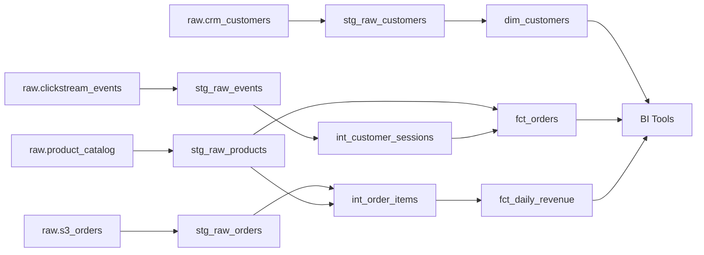

# dbt-snowflake-repo

## Overview

This repository contains a production-grade dbt data pipeline for Snowflake, migrated from a legacy Redshift-based ETL system. The pipeline implements a complete dimensional modeling architecture supporting e-commerce analytics, including customer analytics, product performance tracking, and revenue reporting. It processes raw data from CRM systems, clickstream events, and order management systems into clean, business-ready analytics tables.

## Migration Details

| Attribute | Value |
|---|---|
| **Source Repository** | amitcs010/document_generator (Redshift) |
| **Target Platform** | Snowflake + dbt |
| **Target Framework** | dbt Core |
| **Components Migrated** | 12 |
| **Migration Tool** | RepoMigrator (automated) |
| **Migration Date** | 2026-04-06 09:18:53 UTC |

## Repository Structure

```
dbt-snowflake-repo/
├── models/
│   ├── staging/
│   │   ├── stg_raw_customers.sql
│   │   ├── stg_raw_events.sql
│   │   ├── stg_raw_orders.sql
│   │   └── stg_raw_products.sql
│   ├── transforms/
│   │   ├── int_customer_sessions.sql
│   │   └── int_order_items.sql
│   └── marts/
│       ├── dim_customers.sql
│       ├── dim_products.sql
│       ├── fct_daily_revenue.sql
│       └── fct_orders.sql
├── macros/
│   └── data_quality_checks.sql
├── config/
│   └── schema_setup.sql
├── tests/
├── dbt_project.yml
├── profiles.yml.example
└── docs/
    ├── FULL_DOCUMENTATION.md
    ├── COMPONENT_INDEX.md
    ├── DATA_LINEAGE.md
    ├── VALIDATION_REPORT.json
    └── files/
```

## dbt Project Setup

### Prerequisites

- Snowflake account with appropriate warehouse and database permissions
- dbt Core >= 1.7
- Python 3.8+
- Git

### Installation

```bash
# Clone repository
git clone <repository-url>
cd dbt-snowflake-repo

# Install dbt and dependencies
pip install dbt-snowflake>=1.7.0

# Install dbt package dependencies
dbt deps

# Configure Snowflake connection
cp profiles.yml.example ~/.dbt/profiles.yml
# Edit ~/.dbt/profiles.yml with your Snowflake credentials
```

### Configuration

Update `~/.dbt/profiles.yml` with your Snowflake connection details:

```yaml
dbt-snowflake-repo:
  target: dev
  outputs:
    dev:
      type: snowflake
      account: [account-id]
      user: [username]
      password: [password]
      role: [role]
      database: [database]
      schema: analytics_dev
      warehouse: [warehouse]
      threads: 4
      client_session_keep_alive: False
```

### Running dbt

```bash
# Run all models
dbt run

# Run tests
dbt test

# Run specific model selection
dbt run --select staging
dbt run --select marts.dim_customers

# Run with full refresh
dbt run --full-refresh

# Generate documentation
dbt docs generate
dbt docs serve
```

## Models

### Staging Layer

| Model | Description | Source |
|---|---|---|
| `stg_raw_customers` | Deduplicated CRM customer data with PII masking | raw.crm_customers |
| `stg_raw_events` | Parsed clickstream events from JSON payloads | raw.clickstream_events |
| `stg_raw_orders` | Cleaned order data with test order filtering | raw.s3_orders |
| `stg_raw_products` | Product inventory data with SCD Type 1 tracking | raw.product_catalog |

### Transforms Layer

| Model | Description | Dependencies |
|---|---|---|
| `int_customer_sessions` | Session-level aggregations with attribution metrics | stg_raw_events |
| `int_order_items` | Item-level revenue, margin, and discount calculations | stg_raw_orders, stg_raw_products |

### Marts Layer

| Model | Description | Grain | Dependencies |
|---|---|---|---|
| `dim_customers` | Customer dimension with RFM scoring and LTV | One row per customer | stg_raw_customers |
| `dim_products` | Product dimension with aggregated performance metrics | One row per product | stg_raw_products |
| `fct_orders` | Order fact table with customer and session context | One row per order | stg_raw_orders, stg_raw_customers, int_customer_sessions |
| `fct_daily_revenue` | Daily revenue aggregations by product, category, channel, and country | One row per day/product/channel/country | int_order_items |

## Data Lineage



## Key Changes from Source

### Platform Migration (Redshift → Snowflake)

- **SQL Dialect**: Converted Redshift-specific functions to Snowflake equivalents
  - `DISTKEY` → Snowflake clustering keys
  - `SORTKEY` → Snowflake clustering keys
  - `LISTAGG()` → `LISTAGG()` (compatible)
  - Date functions standardized to Snowflake syntax

- **DDL Removal**: Schema creation and table materialization now handled by dbt
  - Removed `CREATE TABLE` statements
  - Removed `CREATE SCHEMA` statements
  - Materialization configured in `dbt_project.yml`

- **Reference Management**: Updated all table references
  - Raw tables: `{{ source('raw', 'table_name') }}`
  - Model references: `{{ ref('model_name') }}`

- **Data Quality Checks**: Converted Python-based checks to dbt tests
  - Macro-based validation logic in `macros/data_quality_checks.sql`
  - dbt native tests for null checks, uniqueness, and referential integrity

### Framework Migration (Custom ETL → dbt)

- Centralized model documentation and testing
- Version-controlled transformations with Git
- Automated lineage tracking and documentation generation
- Built-in data quality framework

## Documentation

Comprehensive documentation is available in the `docs/` directory:

| Document | Purpose |
|---|---|
| `FULL_DOCUMENTATION.md` | Complete technical documentation and architecture overview |
| `COMPONENT_INDEX.md` | Detailed index of all 12 migrated components |
| `DATA_LINEAGE.md` | Visual and textual data lineage documentation |
| `VALIDATION_REPORT.json` | Migration validation results and compatibility checks |
| `files/` | Per-model documentation and metadata |

## Testing & Validation

```bash
# Run all tests
dbt test

# Run tests for specific model
dbt test --select dim_customers

# Run specific test
dbt test --select stg_raw_customers_unique_customer_id
```

## Troubleshooting

### Connection Issues
- Verify Snowflake credentials in `~/.dbt/profiles.yml`
- Ensure warehouse is active and accessible
- Check network connectivity to Snowflake

### Model Failures
- Review logs: `dbt run --debug`
- Check data quality: `dbt test`
- Validate source data availability

### Performance
- Adjust `threads` in profiles.yml for parallel execution
- Review Snowflake query history for slow queries
- Consider warehouse scaling for large datasets

## Support & Contribution

For issues, questions, or contributions:
1. Review existing documentation in `docs/`
2. Check dbt documentation: https://docs.getdbt.com/
3. Consult Snowflake documentation: https://docs.snowflake.com/

## Auto-Generated Notice

This repository and README were auto-generated by **RepoMigrator** from the source repository `amitcs010/document_generator` (Redshift-based ETL system).

**Last Updated**: 2026-04-06 09:18:53 UTC

---

*For detailed migration notes and component-level documentation, see `docs/COMPONENT_INDEX.md`*