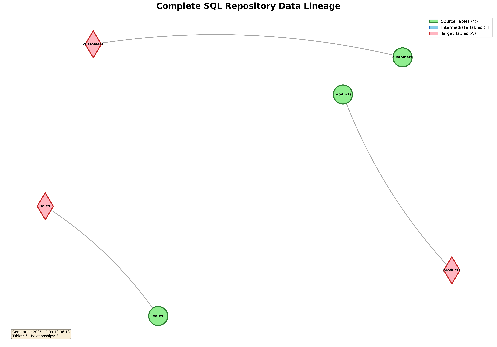

# SQL Repository Analysis Report

## Executive Summary

This report provides a detailed technical analysis of the SQL repository, which serves as a foundational component for the organization's analytical data processing. The repository currently comprises 8 distinct SQL files, encompassing stored procedures, scripts, data models, and views, designed to transform raw operational data into structured, consumable datasets for business intelligence and reporting. Its primary purpose is to establish a robust data pipeline that enriches raw sales and customer information, calculates key performance indicators like customer lifetime value, and provides summarized data for daily operations and strategic decision-making.

The architecture observed within this repository demonstrates a commendable adherence to a multi-layered data warehousing approach, distinguishing between raw ingestion, staging for cleaning and transformation, and an analytics layer for final consumption. This structure, coupled with specific data models and analytical views, indicates a clear intent to build a scalable and maintainable data foundation. The repository currently manages 13 tables/objects and defines 9 data relationships, reflecting its critical role in shaping the organization's data landscape.

Overall, the repository is a functional asset, providing essential data transformations and aggregations. While it establishes a solid architectural base, the analysis identifies several opportunities for enhancement, particularly in areas of data orchestration, comprehensive documentation, and robust error handling, which are crucial for evolving into a truly mature and resilient data platform.

## Repository Overview

The SQL repository consists of 8 files, strategically categorized by their function:

*   **Stored Procedures (2 files):** `sp_update_customer_scores.sql`, `sp_refresh_daily_sales.sql`
*   **Scripts (4 files):** `sales_orders.sql`, `customer_summary.sql`, `ctas_create_sales_clean.sql`, `sales_enriched_pipeline.sql`
*   **Data Models (1 file):** `dim_products.sql`
*   **Views (1 file):** `vw_top_customers.sql`

This breakdown indicates a preference for utilizing different SQL constructs to address specific data processing needs, from iterative updates (stored procedures) to dimension creation (data models) and simplified data access (views).

**Structure and Naming Conventions:**
The repository exhibits a thoughtful approach to file naming, which generally aligns with common best practices:
*   `sp_` prefix for stored procedures (e.g., `sp_update_customer_scores`).
*   `dim_` prefix for dimension tables (e.g., `dim_products`).
*   `vw_` prefix for views (e.g., `vw_top_customers`).
*   Scripts generally use descriptive names related to their output (e.g., `sales_orders`, `customer_summary`).
*   The `ctas_` prefix for `ctas_create_sales_clean.sql` explicitly indicates a "CREATE TABLE AS SELECT" operation, which is clear.

The consistent use of schema prefixes (e.g., `raw.`, `staging.`, `analytics.`) within the scripts demonstrates a commitment to organizing data logically across different architectural layers, significantly aiding in understanding data provenance and purpose.

## Data Architecture

The SQL repository implements a well-defined multi-layered data architecture, which is a hallmark of robust data warehousing practices. This architecture can be distinctly categorized into three primary layers:

1.  **Raw Layer (`raw` schema):**
    *   **Purpose:** This is the initial ingestion point for data directly from source systems, preserved in its original form. It serves as an immutable historical record and a foundation for all subsequent transformations.
    *   **Objects:** `raw.orders`, `raw.products`, `raw.customers`, `raw.sales`.
    *   **Characteristics:** Minimal to no transformations occur here. Data is typically loaded as-is.

2.  **Staging Layer (`staging` schema):**
    *   **Purpose:** The staging layer acts as an intermediate area where raw data undergoes initial cleansing, basic transformations, and harmonization before being moved to the analytical layer. This layer isolates the raw data from complex business logic.
    *   **Objects:** `staging.sales_clean` (created by `ctas_create_sales_clean.sql`), and implicitly, `staging.sales_orders` (as a source for `analytics.daily_sales` in `sp_refresh_daily_sales.sql`).
    *   **Characteristics:** Focus on data quality, data type conversions, handling missing values, and light aggregations. It might involve temporary tables or CTAS operations.

3.  **Analytics Layer (`analytics` schema / Business Ready Data):**
    *   **Purpose:** This is the final destination for business-ready data. It contains curated, aggregated, and enriched datasets optimized for reporting, dashboards, and analytical applications. It adheres to specific data models (e.g., dimensional models) and often includes derived metrics.
    *   **Objects:** `analytics.customer_scores` (target of `sp_update_customer_scores.sql`), `analytics.daily_sales` (target of `sp_refresh_daily_sales.sql`), `analytics.vw_top_customers` (target of `vw_top_customers.sql`). Other objects like `sales_orders`, `dim_products`, `customer_summary` are likely intended for or reside within this layer (or a similar 'integrated' layer), given their analytical purpose and use as sources for `analytics` objects.
    *   **Characteristics:** Optimized for query performance, includes complex business logic, aggregations, and may involve star/snowflake schemas.

This layered approach promotes modularity, simplifies troubleshooting, and ensures data quality at each stage of the pipeline.

## Complete Data Lineage

The data lineage within this repository describes the comprehensive flow of information from its raw sources through various transformations to its ultimate analytical targets. (Refer to `lineage_diagram.png` for a visual representation of these dependencies.)

Here's a detailed description of the end-to-end data flow:

1.  **Raw Ingestion:** Data originates from the `raw` schema, with tables such as `raw.orders`, `raw.products`, `raw.customers`, and `raw.sales` serving as primary sources.

2.  **Product Dimension Creation:**
    *   `raw.products` is transformed by `dim_products.sql` to create `dim_products`. This establishes a core product dimension, likely used across various analytical datasets.

3.  **Sales Data Cleansing & Enrichment:**
    *   **Initial Sales Clean-up:** `raw.sales` is processed by `ctas_create_sales_clean.sql` to produce `staging.sales_clean`. This suggests an initial step of cleaning and standardizing raw sales records.
    *   **Core Sales Order Enrichment:** `raw.orders` and `dim_products` (which originates from `raw.products`) are joined and enriched by `sales_orders.sql`. The output, `sales_orders`, serves as a fundamental dataset for more complex analytics. This `sales_orders` table is critical as it feeds into multiple downstream processes.
    *   **Daily Sales Refresh:** The `staging.sales_orders` (implied to be an intermediate staging artifact of sales orders, potentially from `sales_orders.sql` or another source) is truncated and reloaded into `analytics.daily_sales` by `sp_refresh_daily_sales.sql`. This provides a daily aggregated view of sales.
    *   **Sales Enrichment Pipeline (Potential Gap):** `raw.orders`, `raw.customers`, and `raw.products` are used by `sales_enriched_pipeline.sql` for enrichment. *However, this script currently has no explicit target, indicating either an incomplete process, a temporary output that is not persisted, or an unmanaged data artifact.*

4.  **Customer Data Integration & Scoring:**
    *   **Customer Summary:** `raw.customers` and the `sales_orders` dataset (which is derived from `raw.orders` and `dim_products`) are combined by `customer_summary.sql` to generate `customer_summary`. This creates a comprehensive view of customers linked with their sales activities.
    *   **Customer Score Updates:** `analytics.sales_orders` (likely the same `sales_orders` output from step 3, implicitly residing in the analytics layer or accessible for analytics) is utilized by `sp_update_customer_scores.sql` to update or insert metrics into `analytics.customer_scores`. This process derives key customer value metrics like lifetime value and order count.

5.  **Analytical View Creation:**
    *   `analytics.sales_orders` (again, the enriched sales order data) is used by `vw_top_customers.sql` to create `analytics.vw_top_customers`. This view provides an accessible summary of high-value customers.

In summary, data moves from the `raw` layer, undergoes initial cleansing in `staging` (e.g., `staging.sales_clean`), then gets enriched and aggregated into logical data entities like `dim_products`, `sales_orders`, and `customer_summary`. Finally, these integrated datasets are used to derive specific analytical outputs such as `analytics.daily_sales`, `analytics.customer_scores`, and `analytics.vw_top_customers`, providing actionable insights.

## Component Analysis

### Views
*   **File:** `vw_top_customers.sql`
*   **Purpose:** This view identifies customers who have spent more than a specified threshold (e.g., 10,000). It serves to simplify access to high-value customer segments for reporting and analysis without requiring direct complex joins or calculations.
*   **Sources:** `analytics.sales_orders`
*   **Targets:** `analytics.vw_top_customers`
*   **Analysis:** Views are excellent for abstracting complex queries, enforcing security by limiting access to specific columns/rows, and promoting data consistency. This view effectively leverages an existing analytical table (`analytics.sales_orders`) to create a focused, business-friendly dataset.

### Stored Procedures
*   **File:** `sp_update_customer_scores.sql`
*   **Purpose:** Updates or inserts customer lifetime value and order count metrics into a dedicated `analytics.customer_scores` table. This indicates an incremental processing approach for customer analytics.
*   **Sources:** `analytics.sales_orders`
*   **Targets:** `analytics.customer_scores`
*   **Analysis:** Stored procedures are ideal for encapsulating complex business logic, performing transactional operations (UPSERTs), and managing stateful processes. Their use here for incremental updates to `customer_scores` is appropriate for maintaining aggregate metrics efficiently.

*   **File:** `sp_refresh_daily_sales.sql`
*   **Purpose:** Refreshes the `analytics.daily_sales` table by truncating existing data and reloading it from `staging.sales_orders`. This represents a full daily refresh pattern.
*   **Sources:** `staging.sales_orders`
*   **Targets:** `analytics.daily_sales`
*   **Analysis:** This procedure efficiently provides a fresh daily snapshot. Truncate-and-load is simple and effective for smaller to medium-sized datasets where historical changes aren't tracked within the daily table itself. For very large datasets, an incremental approach might be more performant, but for "daily sales," a full refresh is often acceptable.

### Data Models
*   **File:** `dim_products.sql`
*   **Purpose:** Creates a dimension table named `dim_products` by selecting specific product attributes from the raw product data.
*   **Sources:** `raw.products`
*   **Targets:** `dim_products`
*   **Analysis:** The creation of `dim_products` signifies an adherence to dimensional modeling principles, which is crucial for building efficient and understandable analytical databases. Dimension tables are foundational for star schemas, enabling robust slicing and dicing of fact data.

### ETL Scripts
*   **File:** `sales_orders.sql`
*   **Purpose:** Enriches raw sales order data with product details and calculates the total order amount.
*   **Sources:** `raw.orders`, `dim_products`
*   **Targets:** `sales_orders`
*   **Analysis:** This script is a core transformation, merging raw transactional data with dimensional attributes. Its output `sales_orders` is a critical intermediate dataset feeding subsequent analytical processes.

*   **File:** `customer_summary.sql`
*   **Purpose:** Creates a comprehensive summary of customer details, including their total revenue and order counts.
*   **Sources:** `sales_orders`, `raw.customers`
*   **Targets:** `customer_summary`
*   **Analysis:** This script performs analytical aggregation, combining customer master data with their transactional activity to create a valuable summary table, useful for various business intelligence applications.

*   **File:** `ctas_create_sales_clean.sql`
*   **Purpose:** Creates or replaces a cleaned sales table in the staging schema by transforming and filtering data from `raw.sales`.
*   **Sources:** `raw.sales`
*   **Targets:** `staging.sales_clean`
*   **Analysis:** This script explicitly supports the staging layer's objective of data cleansing and preliminary transformation, which is a good practice for data quality before moving to analytical stages. The CTAS approach ensures a fresh, clean dataset.

*   **File:** `sales_enriched_pipeline.sql`
*   **Purpose:** Enriches individual sales order records by joining them with customer and product information.
*   **Sources:** `raw.orders`, `raw.customers`, `raw.products`
*   **Targets:** [] (None specified)
*   **Analysis:** This script performs significant data enrichment. **The lack of a specified target is a major concern.** It implies that the output of this enrichment is either discarded, used for ad-hoc analysis, or its persistence is managed outside the scope of this repository. This poses a risk of unmanaged data, potential data loss, or inefficiency if the enrichment needs to be run repeatedly without saving results. It duplicates some logic found in `sales_orders.sql` (joining raw orders with product data) and `customer_summary.sql` (using raw customers).

## Technical Assessment

### Strengths (3-5 points)

1.  **Clear Layered Architecture:** The explicit use of `raw`, `staging`, and `analytics` schemas demonstrates a well-thought-out data architecture, promoting data quality, modularity, and maintainability.
2.  **Purpose-Driven Object Usage:** The repository effectively leverages different SQL object types (SPs for logic/updates, Views for simplified access, Models for dimensions, Scripts for ETL) according to their best-fit purposes.
3.  **Consistent Naming Conventions:** The adherence to prefixes like `sp_`, `vw_`, `dim_` significantly enhances readability and understandability across the repository.
4.  **Foundational Data Models:** The inclusion of `dim_products` and the structure around `sales_orders` indicates a good start towards dimensional modeling, crucial for efficient analytical queries.
5.  **Focus on Key Business Metrics:** The generation of `customer_scores` and `daily_sales` directly supports critical business intelligence and performance monitoring, demonstrating immediate business value.

### Areas for Improvement (3-5 points)

1.  **Unmanaged Script Output:** The `sales_enriched_pipeline.sql` script lacks a defined target, creating an unpersisted or unmanaged data flow, which is a significant architectural gap and potential data governance risk.
2.  **Lack of Explicit Orchestration:** The repository does not indicate how these scripts and stored procedures are scheduled or executed in a sequence. Without an orchestration layer, data freshness, dependencies, and error handling are likely managed manually, leading to inconsistencies and operational burden.
3.  **Potential for Redundancy/Overlap:** There appears to be some overlap in data processing, especially concerning sales order enrichment (e.g., `sales_orders.sql`, `ctas_create_sales_clean.sql`, and `sales_enriched_pipeline.sql` all process sales-related data from raw sources). A clearer definition of responsibilities and dependencies among these could streamline the pipeline.
4.  **Limited Error Handling and Logging:** While stored procedures can include error handling, there's no explicit mention or pattern of robust error handling or activity logging within the provided sample, which is critical for production environments.
5.  **Documentation Detail:** While 'purpose' is provided, detailed in-code comments, data dictionary generation, or comprehensive READMEs for complex scripts are not evident, which can lead to maintainability challenges as the repository grows.

## Recommendations

1.  **Define and Implement a Target for `sales_enriched_pipeline.sql`:** Clarify the intended outcome of this script. If the enriched data is valuable, it must be persisted to a specific table in an appropriate schema (e.g., `staging` or `analytics`). If it's ad-hoc, it should be clearly labeled or considered for removal if redundant.
2.  **Introduce a Data Orchestration Layer:** Implement a dedicated tool or framework (e.g., Apache Airflow, Azure Data Factory, AWS Step Functions, dbt) to manage the scheduling, execution, and dependency mapping of all SQL components. This will ensure consistent data freshness and improve operational visibility.
3.  **Standardize Error Handling and Logging:** Incorporate robust `TRY...CATCH` blocks in all stored procedures and critical scripts. Implement a centralized logging mechanism to capture execution details, warnings, and errors, aiding in troubleshooting and monitoring.
4.  **Enhance In-Code Documentation and Metadata:** For each SQL file, add detailed header comments explaining parameters, expected inputs, outputs, business logic, and potential side effects. Consider tools for automated data dictionary generation from database schemas and SQL comments.
5.  **Refine Data Transformation Dependencies:** Conduct a deeper analysis to consolidate or clearly define the unique purpose of scripts like `sales_orders.sql`, `ctas_create_sales_clean.sql`, and `sales_enriched_pipeline.sql` to avoid redundant processing and ensure a single source of truth for specific transformations.
6.  **Implement Data Quality Checks:** Integrate explicit data quality checks (e.g., uniqueness, completeness, range checks) within the staging layer. For example, add assertions or validation queries to `ctas_create_sales_clean.sql` or create dedicated data quality scripts.
7.  **Establish Version Control and CI/CD:** Ensure all SQL assets are managed under a robust version control system (e.g., Git). Implement CI/CD pipelines for automated testing, deployment, and rollback capabilities for all database changes.

## Risk Assessment

1.  **Technical Debt (High):** The unmanaged output of `sales_enriched_pipeline.sql` is a significant piece of technical debt. It represents a process that is either incomplete, ignored, or creates temporary data whose lifecycle is not governed, potentially leading to inconsistencies or inefficient re-processing.
2.  **Data Freshness and Consistency (Medium-High):** Without a formal orchestration mechanism, the timely and ordered execution of these scripts and procedures is at risk. This can lead to stale data in analytical tables or inconsistencies if dependencies are not manually managed correctly.
3.  **Maintainability and Scalability (Medium):** Limited in-code documentation and potential overlaps in transformation logic can increase the cognitive load for new developers, hindering future maintenance and scaling efforts. As data volumes grow, unoptimized scripts without clear logging can become performance bottlenecks and difficult to debug.
4.  **Data Quality (Medium):** While a staging layer exists, the explicit definition and enforcement of data quality rules appear to be implicit rather than codified. This introduces a risk of propagating dirty or incorrect data into the analytical layer.
5.  **Operational Overhead (Medium):** Manual execution or simple cron jobs for these processes can lead to significant operational overhead, especially during failures, where manual intervention might be required to identify and restart pipelines.

## Conclusion

This SQL repository forms a valuable backbone for the organization's analytical data processing, demonstrating a strong architectural foundation with its multi-layered design and clear separation of concerns using various SQL objects. It successfully transforms raw data into key business metrics and analytical datasets, thereby contributing significant business value.

However, to evolve into a fully mature, robust, and scalable data platform, critical enhancements are needed. Addressing the unmanaged output of `sales_enriched_pipeline.sql`, implementing a dedicated orchestration layer, bolstering error handling and logging, and improving documentation are paramount. These steps will not only mitigate existing risks but also improve the maintainability, reliability, and trustworthiness of the data assets.

**Next Steps:** I recommend initiating a follow-up engagement to delve deeper into the specific implementation details of each SQL file, map out all implicit data dependencies, and develop a phased roadmap for implementing the recommended improvements, prioritizing those that address the highest risks and deliver the most immediate operational benefits.

## Visual Data Lineage

*The diagram above shows the complete data lineage across all SQL files in the repository.*

## Detailed File Inventory

| # | File Name | Type | Purpose | Sources | Targets |
|---|-----------|------|---------|---------|----------|
| 1 | `sp_update_customer_scores.sql` | stored_procedure | Updates or inserts customer lifetime value and ord | analytics.sales_orders | analytics.customer_scores |
| 2 | `sp_refresh_daily_sales.sql` | stored_procedure | Refreshes the `analytics.daily_sales` table by tru | staging.sales_orders | analytics.daily_sales |
| 3 | `sales_orders.sql` | script | Enriches raw sales order data with product details | raw.orders, dim_products | sales_orders |
| 4 | `dim_products.sql` | model | Creates a dimension table named dim_products by se | raw.products | dim_products |
| 5 | `customer_summary.sql` | script | This SQL script creates a comprehensive summary of | sales_orders, raw.customers | customer_summary |
| 6 | `vw_top_customers.sql` | view | This SQL creates a view that identifies customers  | analytics.sales_orders | analytics.vw_top_customers |
| 7 | `ctas_create_sales_clean.sql` | script | Creates or replaces a cleaned sales table in the s | raw.sales | staging.sales_clean |
| 8 | `sales_enriched_pipeline.sql` | script | This SQL script enriches individual sales order re | raw.orders, raw.customers, raw.products | - |

---
*Generated: 2025-12-04 11:07:26*
*Files: 8 | Tables: 13 | Relationships: 9*
